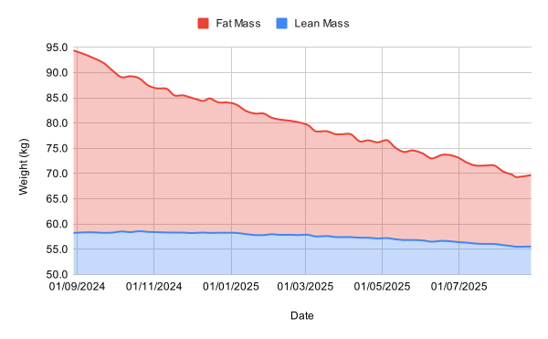
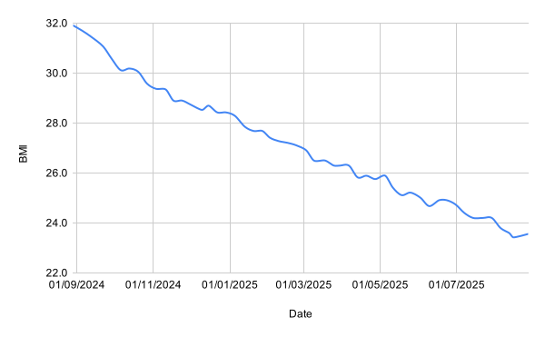

---
date:
  created: 2025-11-02
authors:
  - mash
categories:
  - Health
description: A data-driven deep dive into the science and numbers behind a year-long transformation.
tags:
  - Fitness
  - Weight Loss
---

# My health and fitness journey: Part 3

Welcome to the third and final part of this blog series. In [Part 1](fitness-journey-1.md), I outlined a scientific and analytical plan to transform my health and fitness by my 40th birthday. No fads, no guesswork, no pseudo-science — just measurable data, evidence-based methods, and a willingness to test and iterate on myself as the subject. In [Part 2](fitness-journey-2.md), I obsessively tracked and shared 52 weeks of raw data as I executed that plan.

Now it's time to connect the dots — to bring the theory and the data together and understand why this worked.

<!-- more -->

This post is both a celebration of what I achieved and an exploration of how a scientific method, powered by consistent systems and the principles from James Clear’s _Atomic Habits_, led to transformation.

## What Happened?

Let's start with the headline numbers.

| Metric     | Start   | Goal               | Result  | Change       |
| ---------- | ------- | ------------------ | ------- | ------------ |
| Weight     | 94.4 kg | 67.9 kg to 73.8 kg | 69.7 kg | **−24.7 kg** |
| Body fat   | 38.3%   | 18% to 22%         | 20.3%   | **−18.0 pp** |
| Lean mass  | 58.2 kg | 53.4 kg to 55.4 kg | 55.6 kg | **−2.6 kg**  |
| BMI        | 31.9    | 22.0 to 24.0       | 23.6    | **−8.3**     |
| Resting HR | 61 bpm  | <60 bpm            | 55 bpm  | **−6 bpm**   |

In simple terms, I've gone from clinically obese to a healthy BMI, halved my body fat percentage, and reached the ideal weight range I calculated at the very start of this journey. :tada:

### Weight Loss Over Time

{ width="600" }

Looking at the chart of my actual progress, you can see the compounding effect of small, daily decisions. The overall weight trend is remarkably consistent. There were inevitable lumps, but across the full 52 weeks the line follows an exponential decay — rapid early change as glycogen and water stores reduced, followed by slower, sustained loss as energy balance stabilised.

Each interim goal I set along the way was achieved almost exactly on schedule, confirming that the predictive models I built in [Part 1](fitness-journey-1.md) were not only reasonable but also accurate. This proves that a slow, steady, and predictable loss of ~0.47 kg (1 lb) per week is not only achievable but incredibly sustainable.

### Body Composition and Fat Reduction

{ width="600" }

The real success lies here. While the scale shows −24.7 kg, the body composition chart reveals that the majority came from fat mass, dropping from 36.2 kg to 14.1 kg. My lean mass reduced only slightly, which is a strong indicator that the calorie deficit was modest, protein intake was sufficient, and the exercise strategy effectively preserved muscle tissue.

From a metabolic standpoint, this is exactly what the research predicts: maintaining moderate activity and adequate protein during weight loss preserves lean mass, which in turn sustains resting metabolic rate.

### BMI and Cardiovascular Improvements

{ width="600" }

BMI isn't perfect, but it's consistent. Moving from 31.9 to 23.6 represents a shift from a high-risk category, down through "Overweight", and solidly into the middle of the "Healthy" range. For the first time in years, every biometric I track sits comfortably in the green.

{ width="600" }

Meanwhile, my resting heart rate fell from 61 bpm to 55 bpm (with a low of 53 bpm in Week 49). This 10% drop might not sound dramatic, but physiologically it's significant — a sign of improved stroke volume, parasympathetic tone, and overall cardiovascular efficiency. It's the direct outcome of spending a year training predominantly in my Zone 2 range (around 145 bpm), where aerobic adaptation occurs most effectively.

My heart is stronger and more effective, having to do less work to pump blood around a body that is 24.7 kg lighter. This is a profound long-term health improvement.

## Why It Worked

The real success wasn't just that I lost the weight; it's how I lost it. My plan was built on two core principles: a consistent calorie deficit and specific, heart-rate-controlled exercise. Let's see how they held up.

### Diet

**The Plan**: To create a 500-750 kcal daily deficit, aiming for an intake of 1,872 - 2,122 kcal per day.

**The Theory**: This consistent deficit would be the primary driver of fat loss, as I could not simply _"out-train a bad diet"_.

**The Analysis**: The data from [Part 2](fitness-journey-2.md) allows us to reverse-engineer the results and validate this theory. A commonly accepted figure is that 1 kg of body fat stores approximately 7,700 kcal of energy. My body composition data shows my fat mass dropped from 36.2 kg to 14.1 kg, a total fat loss of 22.1 kg.

Now for the maths: 22.1 kg of fat × 7,700 kcal/kg = 170,170 kcal

That is the total calorie deficit I achieved over the entire year, purely from fat stores. To find the average daily deficit, we divide by the 364 days in the 52-week period: 170,170 kcal ÷ 364 days = 467 kcal/day

This is the most satisfying finding of the entire experiment. My theoretical plan aimed for a deficit starting at 500 kcal, and my real-world, observed average deficit calculated from the fat I actually lost was 467 kcal.

**Conclusion**: The TDEE and BMR formulas I researched in [Part 1](fitness-journey-1.md) were not just academic; they were incredibly accurate predictors of my real-world energy needs. It confirms the core principle: a small, consistent, and mathematically-sound calorie deficit will deliver predictable results. Every calorie I logged, every workout I tracked, was a data point feeding into the fundamental law of thermodynamics: energy in versus energy out.

By prioritising lean protein (35% of calories), moderating fats, and keeping carbohydrates functional rather than indulgent, I avoided the "diet fatigue" that derails most plans.

### Exercise

**The Plan**: To perform 150+ minutes of cardio per week at a Target Heart Rate (THR) of ~145 bpm, calculated using the Karvonen formula.

**The Theory**: This "Zone 2" or "Moderate" intensity exercise would maximise the percentage of calories burned from stored fat (rather than glycogen) and, when combined with a high-protein diet, help preserve lean muscle mass.

**The Analysis**: This is where the body composition data becomes crucial. Weight loss is easy to track, but what you lose is what matters.

- Total Weight Lost: 24.7 kg
- Fat Mass Lost: 22.1 kg
- Lean Mass Lost: 2.6 kg

Let's look at that as a ratio. Of all the weight I lost:

- 89.5% was Fat
- 10.5% was Lean Mass

**Conclusion**: This is a phenomenal success. It is metabolically impossible to be in a significant calorie deficit for a year and lose _zero_ lean mass. However my lean mass remained remarkably stable, while my fat mass plummeted. To have kept ~90% of the loss to fat is a direct validation of the plan. The lower-intensity cardio strategy delivered exactly what the literature suggests: improved fat oxidation, better recovery, and reduced cardiovascular strain. The heart rate data confirms the adaptation, with my resting rate steadily dropping as efficiency improved. This is why I don't just look thinner; I'm leaner and healthier.

## What I Learned

As a software developer, no project is complete without a retrospective. Reflecting on the process, a few things stand out, many of which echo the principles in _Atomic Habits_, which was an inspirational resource for me.

1. **Trust the Process (_Plateau of Latent Potential_)**: There were plateaus and rebounds. In weeks 45-48, my weight stalled completely at 71.6 kg. In the past, this would have caused me to panic, over-train, or crash diet. This time, I trusted the data. I was in what James Clear calls the _"Plateau of Latent Potential"_ —the work was being done, but the results were delayed. I knew my deficit was in place, and sure enough, the trend resumed. You must trust the system, not the noisy data of a single day.
2. **Consistency Beats Intensity (_Systems > Goals_)**: This entire journey was not about _"beasting"_ myself in the gym, or starving myself. It was about the relentless, boring, and sustainable effect of consistency. A 500 kcal deficit is barely noticeable. A 30-minute run at 145 bpm is challenging but not destructive. Each time I did it, I was _"casting a vote"_ for the new identity I wanted to build. My goal might have been to reach a healthy weight, but the system was what got me there: daily calorie tracking, structured exercise, and weekly reviews. I didn't wake up every day trying to _"lose weight"_; I just followed my system. The outcome became inevitable.
3. **The 5% Goals Were Critical (_Make it Satisfying_)**: A 25 kg weight loss goal is demoralising. A 5% goal (4.7 kg) is achievable. The plan in [Part 1](fitness-journey-1.md) to set these incremental goals was a lifeline. The "Goals" table in [Part 2](fitness-journey-2.md) shows I ticked one off every 2-3 months. This turned long-term delayed gratification into short-term reward. It was the perfect way to _"Make it Satisfying"_ and keep the _"dopamine reward train"_ on the tracks.

!!! quote "Atomic Habits"
    _"You do not rise to the level of your goals, you fall to the level of your systems."_

I've learned that self-discipline isn't about pure willpower — it's about environment design. By building a system of positive habits that are obvious, attractive, easy, and satisfying, the outcomes took care of themselves

## Final Thoughts

A year ago, I called this _"a scientific, analytical, and evidence-based journey."_ Now I can say it was also a deeply human one — equal parts data and discipline, calculation and consistency. I wrote; _"I just don't want to let social anxiety keep me from enjoying life."_

The data shows the physical change. But the real outcome is the one I can't plot on a graph. It's the energy to do my job, commute, and still have time for my family. It's the confidence of knowing I can take my shirt off on a beach and the only thing on my mind will be enjoying the moment.

By treating my body as a system to understand rather than a problem to fix, I turned an aspiration into a reproducible process. This wasn't luck, and it wasn't just hard work — it was science applied with persistence, guided by the principles of habit formation.

I'm not just lighter or fitter now; I'm living proof that consistent evidence-based effort works. I didn't just run a 12-month project; I built a system for a healthier life. And in _this_ case, the system works.

---

[:fontawesome-brands-bluesky: Share on Bluesky](https://bsky.app/intent/compose?text={{ page.title | urlencode }} by @mash85.bsky.social {{ page.canonical_url }} %23{{ tag | replace(" ", "") }} ){ .md-button .md-button--primary }

[:fontawesome-brands-x-twitter: Share on Twitter](https://twitter.com/intent/tweet?text={{ page.title | urlencode }}&url={{ page.canonical_url }}&hashtags={{ tag | replace(" ", "") }},&via=MattShaw85){ .md-button .md-button--primary }
