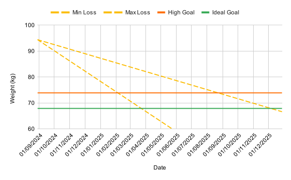

---
date:
  created: 2024-08-29
  updated: 2025-04-13
authors:
  - mash
categories:
  - Health
description: I am starting a new health and fitness journey and documenting my progress.
tags:
  - Fitness
  - Weight Loss
---

# My health and fitness journey

I am starting a new health and fitness journey and documenting my progress. Hopefully this will help to keep me accountable to myself, and maybe even help some other people with their own journey. I'm going to approach this in a scientific, mathematical, analytical and evidence-based way, so expect lots of stats and graphs!

<!-- more -->

## Why am I doing this?

I've recently turned 39, and whilst I don't have any particular qualms about hitting the big four zero, it seems like a good milestone to aim for. I don't really _do_ birthdays, I've never enjoyed the attention, but one thing I have thought for some time is that I would love to take my family away on holiday for my 40th.

I'm not happy with my body image, but more importantly my health and fitness (both physical and mental) has suffered for some time while other aspects of my life have taken priority. I desperately don't want to lack the confidence to even take my shirt off on the beach, for fear of being _"that fat guy"_. I realise that sounds quite vain, but really, I just don't want to let social anxiety keep me from enjoying life. So even though it's embarrassing, I know that admitting and accepting there's a problem is the first step:

| Date     | Weight (kg) | Body fat |
| -------- | ----------- | -------- |
| 29/08/24 | 94.4        | 38.3%    |

This is ground zero, the heaviest and probably the most unfit I have ever been. At least I know this the worst it's going to get.

## Where do I start?

I know from experience that setting a large, far-future goal isn't going to keep me motivated. I need small, incremental, achievable goals, and to be able to clearly see my progress against them. This keeps me on the dopamine reward train. So, I'm setting interim goals of losing **5% of my bodyweight at a time**. Each time I achieve one of these small goals, I set another 5% reduction goal, and so on. But I can't do that forever, so what's my _ultimate_ goal? Even if it isn't what I'm working towards _right now_, I still need to know where I'm trying to get to in the long run.

## Where am I going?

I've done a lot of reading and research about _"ideal weight"_ and of course there are many different studies and methodologies that lead to many different answers. For myself as a 172 cm tall, 39-year-old male:

| Formula         | Weight (kg) |
| --------------- | ----------- |
| Broca (1871)    | 72          |
| Devine (1974)   | 68          |
| Hamwi (1964)    | 69          |
| Lorentz (1929)  | 67          |
| Miller (1983)   | 67          |
| Peterson (2016) | 65          |
| Robinson (1983) | 67          |

Taking an average of those results gives me an ideal weight of 67.9 kg, which seems like reasonable collective wisdom. Then there's BMI, which says I should be between 54.8 kg and 73.9 kg to be in the healthy weight range. Whilst these methods don't take body composition into account and aren't absolutely accurate, at least they are consistent metrics to start from.

I'm going to set my target weight range as between the top end of the BMI healthy range, and my average ideal weight, e.g. **between 67.9 kg and 73.9 kg**. Now we're getting somewhere, but how do I achieve that?

## How do I get there?

To get to my target weight range, I want to reduce my body fat percentage whilst keeping lean muscle mass. The most efficient way to achieve that is through **lower intensity, longer duration cardio** workouts. I used to do a lot of running, but my heart rate would nearly always be in the anaerobic zone, so whilst I would burn more calories overall at that higher intensity, the source of that energy would be from a greater percentage of glycogen, and less from stored fats. I need to be aware of my heart rate while exercising, and to choose activities where I can moderate and pace myself accordingly.

Much like ideal weight, there's a lot of different research and studies into maximum heart rate (HR~max~) and heart rate zones. It's fair to say there's not a definitive answer, and it very much depends on the individual, so I'm going to go with collective wisdom again:

| Name                    | Formula                 | HR~max~ (bpm) |
| ----------------------- | ----------------------- | ------------- |
| Haskell & Fox           | 220 − Age               | 181           |
| Inbar                   | 205.8 − (0.685 × Age)   | 179           |
| Nes                     | 211 − (0.64 × Age)      | 186           |
| Oakland nonlinear       | 192 − (0.007 × Age^2^)  | 181           |
| Tanaka, Monahan & Seals | 208 − (0.7 × Age)       | 181           |
| Wingate                 | 208.609 − (0.716 × Age) | 181           |

Taking a rounded average gives me a HR~max~ of **181 bpm**. But what heart rate should I be targeting for my exercise, in order to maximise the percentage of stored fat used as my primary fuel source? Unsurprisingly again, it depends!

The definition of heart rate zones varies quite significantly too, with Polar, Garmin, Fitbit and Strava all using different percentage ranges to delineate them. Their names vary too, such as _"Zone 2"_, _"Easy"_, _"Light"_ and _"Moderate"_. In any case, it's all about the target heart rate (THR) percentage of my HR~max~ and fortunately there's some general consensus that 60% to 80% is a good range, with the sweet spot at around 70%.

70% of 181 is 127 bpm, so job done? No, not quite. A straight percentage doesn't take into account heart rate reserve (HR~reserve~), which is my HR~max~ minus my resting heart rate (HR~rest~). This will change over time, as I get fitter my HR~rest~ will decrease, giving me a higher HR~reserve~. The Karvonen formula takes this into account: THR = (HR~reserve~ × % intensity) + HR~rest~.

Given my current HR~rest~ of 61 bpm:

| Formula    | 60% | 65% | 70%     | 75% | 80% |
| ---------- | --- | --- | ------- | --- | --- |
| Percentage | 109 | 118 | **127** | 136 | 145 |
| Karvonen   | 133 | 139 | **145** | 151 | 157 |

I need to exercise for **at least 150 minutes per week** at a target heart rate of **around 145 bpm**.

## What about diet?

Weight loss happens in the kitchen, you can't out-train a bad diet. By far the biggest contributor to my progress will be **consistently maintaining a calorie deficit**, i.e. burning more calories than I consume. Of course, I'm not going to just starve myself, so a mixed and healthy diet is important, not just the latest trend of either cutting out or promoting one food group over another. Plenty of lean protein to keep the hunger at bay (and use more energy in digesting it), low sugar, low fat, lots of water, and as little highly processed food as possible.

I'm still going to eat normal meals with my family, which _will_ include the occasional takeaway, as I know that denying myself everything that I enjoy will only lead to resenting the process and failing to achieve my goals. But unhealthy snacks, sugary drinks and alcohol will be kept to an absolute minimum.

To work out how many calories I should consume, first I need to understand my Basal Metabolic Rate (BMR); the number of calories my body needs per day just being alive. This is based on gender, age, height, weight and lean mass, and again there are different formulas for calculating this. Based on my starting weight of 94.4 kg:

| Name                       | Formula                                                       | BMR (kcal/day) |
| -------------------------- | ------------------------------------------------------------- | -------------- |
| Cunningham                 | 500 + (22 x Lean mass)                                        | 1780           |
| Harris-Benedict (Original) | 66.47 + (13.75 x Weight) + (5.003 x Height) - (6.755 x Age)   | 1962           |
| Harris-Benedict (Revised)  | 88.362 + (13.397 x Weight) + (4.799 x Height) - (5.677 x Age) | 1957           |
| Katch-McArdle              | 370 + (21.6 x Lean mass)                                      | 1627           |
| Mifflin-St Jeor            | (10 x Weight) + (6.25 x Height) - (5 x Age) + 5               | 1829           |
| Owen                       | 879 + (10.2 x Weight)                                         | 1842           |
| Schofield                  | 11.6 x Weight + 879                                           | 1974           |

Taking an average gives me a BMR of **1853 kcal per day**. From there I can work out my Total Daily Energy Expenditure (TDEE) which uses a multiplier to take into account my activity level:

| Activity level                          | Multiplier | TDEE (kcal/day) | Max deficit (kcal/day) | Min deficit (kcal/day) |
| --------------------------------------- | ---------- | --------------- | ---------------------- | ---------------------- |
| Sedentary                               | 1.2        | 2224            | 1224                   | 1724                   |
| Light exercise (1-2 days a week)        | 1.375      | 2548            | 1548                   | 2048                   |
| **Moderate exercise (3-5 days a week)** | **1.55**   | **2872**        | **1872**               | **2372**               |
| Heavy exercise (6-7 days a week)        | 1.725      | 3196            | 2196                   | 2696                   |
| Athlete (2x a day)                      | 1.9        | 3521            | 2521                   | 3021                   |

I want to do my 150 minutes of exercise per week over 3 days, so the _"moderate exercise"_ multiplier gives me a TDEE of 2872 kcal per day. But, that's to _maintain_ my current (starting) weight. A healthy weight loss of between 0.4 kg and 0.9 kg per week requires a calorie deficit of between 500 kcal to 1000 kcal per day. So, I need to limit my calorie intake to **between 1872 to 2372 calories per day**, in addition to exercise, to create a consistent deficit. As my weight reduces, the number of calories needed will reduce too, so I will need to evaluate this regularly.

## How long will it take?

I want to reach and maintain my weight in my target range **by my 40th birthday**, which gives me just under a year to achieve it. If I plot a loss of between 0.4 kg and 0.96kg per week you can see the cone I'm aiming to stay within:

{ width="600" }

With no other data yet I can only make an informed guess at best (#NoEstimates :wink:). As time goes on, I'll be able to refine increasingly accurate projections based on empirical evidence and data. As a starting point though:

| Goal weight (kg) | Best case | Worst case |
| ---------------- | --------- | ---------- |
| 89.7             | 06/10/24  | 24/11/24   |
| 85.2             | 10/11/24  | 09/02/25   |
| 80.9             | 15/12/24  | 27/04/25   |
| 76.9             | 12/01/25  | 06/07/25   |
| 73.0             | 16/02/25  | 07/09/25   |
| 69.4             | 16/03/25  | 09/11/25   |

## Let's go!

I'll been keeping track of my progress week-by-week and sharing updates [in this post](fitness-progress.md).

---

[:fontawesome-brands-bluesky: Share on Bluesky](https://bsky.app/intent/compose?text={{ page.title | urlencode }} by @mash85.bsky.social {{ page.canonical_url }} %23{{ tag | replace(" ", "") }} ){ .md-button .md-button--primary }

[:fontawesome-brands-x-twitter: Share on Twitter](https://twitter.com/intent/tweet?text={{ page.title | urlencode }}&url={{ page.canonical_url }}&hashtags={{ tag | replace(" ", "") }},&via=MattShaw85){ .md-button .md-button--primary }
