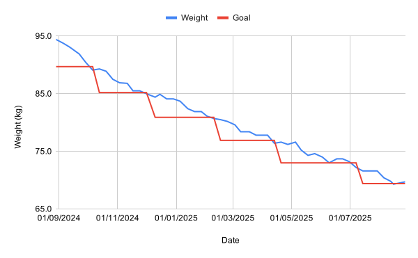

---
date:
  created: 2024-09-05
  updated: 2024-11-17
authors:
  - mash
categories:
  - Health
description: Tracking my ongoing progress towards my health and fitness goals.
tags:
  - Fitness
  - Weight loss
---

# Fitness progress

Tracking my ongoing progress towards my health and fitness goals. See my [original post](fitness-journey.md) for what I'm trying to achieve and how I'm doing it.

<!-- more -->

## Weight

{ width="600" }

??? abstract "Data"

    | Week | Weight (kg) | Difference (kg) | Total (kg) |
    | ---- | ----------- | --------------- | ---------- |
    | 11   | 85.5        | -1.3            | -8.9       |
    | 10   | 86.8        | -0.1            | -7.6       |
    | 9    | 86.9        | -0.6            | -7.5       |
    | 8    | 87.5        | -1.4            | -6.9       |
    | 7    | 88.9        | -0.4            | -5.5       |
    | 6    | 89.3        | +0.2            | -5.1       |
    | 5    | 89.1        | -1.3            | -5.3       |
    | 4    | 90.4        | -1.5            | -4.0       |
    | 3    | 91.9        | -1.2            | -2.5       |
    | 2    | 93.1        | -0.7            | -1.3       |
    | 1    | 93.8        | -0.6            | -0.6       |
    | 0    | 94.4        |                 |            |

## Composition

{ width="600" }

??? abstract "Data"

    | Week | Body fat | Lean mass (kg) | Fat mass (kg) |
    | ---- | -------- | -------------- | ------------- |
    | 11   | 31.8%    | 58.3           | 27.2          |
    | 10   | 32.8%    | 58.3           | 28.5          |
    | 9    | 32.8%    | 58.4           | 28.5          |
    | 8    | 33.2%    | 58.5           | 29.1          |
    | 7    | 34.1%    | 58.6           | 30.3          |
    | 6    | 34.6%    | 58.4           | 30.9          |
    | 5    | 34.3%    | 58.5           | 30.6          |
    | 4    | 35.5%    | 58.3           | 32.1          |
    | 3    | 36.6%    | 58.3           | 33.6          |
    | 2    | 37.3%    | 58.4           | 34.7          |
    | 1    | 37.8%    | 58.3           | 35.5          |
    | 0    | 38.3%    | 58.2           | 36.2          |

## BMI

{ width="600" }

??? abstract "Data"

    | Week | BMI  |
    | ---- | ---- |
    | 11   | 28.9 |
    | 10   | 29.3 |
    | 9    | 29.4 |
    | 8    | 29.6 |
    | 7    | 30.1 |
    | 6    | 30.2 |
    | 5    | 30.1 |
    | 4    | 30.6 |
    | 3    | 31.1 |
    | 2    | 31.5 |
    | 1    | 31.7 |
    | 0    | 31.9 |

## Resting heart rate

{ width="600" }

??? abstract "Data"

    | Week | Resting heart rate |
    | ---- | ------------------ |
    | 11   | 59                 |
    | 10   | 59                 |
    | 9    | 60                 |
    | 8    | 61                 |
    | 7    | 62                 |
    | 6    | 61                 |
    | 5    | 61                 |
    | 4    | 63                 |
    | 3    | 66                 |
    | 2    | 64                 |
    | 1    | 61                 |
    | 0    | 61                 |

## Goals

### Projected

| Goal weight (kg) | Best case  | Worst case |
| ---------------- | ---------- | ---------- |
| 85.2             | 2024-11-24 | 2024-11-24 |
| 80.9             | 2024-12-29 | 2025-02-09 |
| 76.9             | 2025-01-26 | 2025-04-20 |
| 73.0             | 2025-02-23 | 2025-06-29 |
| 69.4             | 2025-03-23 | 2025-08-31 |

### Completed

| Goal weight (kg) | Achieved   |
| ---------------- | ---------- |
| 89.7             | 2024-10-06 |
| 85.2             |            |
| 80.9             |            |
| 76.9             |            |
| 73.0             |            |
| 69.4             |            |

---

[:fontawesome-brands-bluesky: Share on Bluesky](https://bsky.app/intent/compose?text={{ page.title | urlencode }} by @mash85.bsky.social {{ page.canonical_url }} %23{{tag}} ){ .md-button .md-button--primary }

[:fontawesome-brands-x-twitter: Share on Twitter](https://twitter.com/intent/tweet?text={{ page.title | urlencode }}&url={{ page.canonical_url }}&hashtags={{tag}},&via=MattShaw85){ .md-button .md-button--primary }
