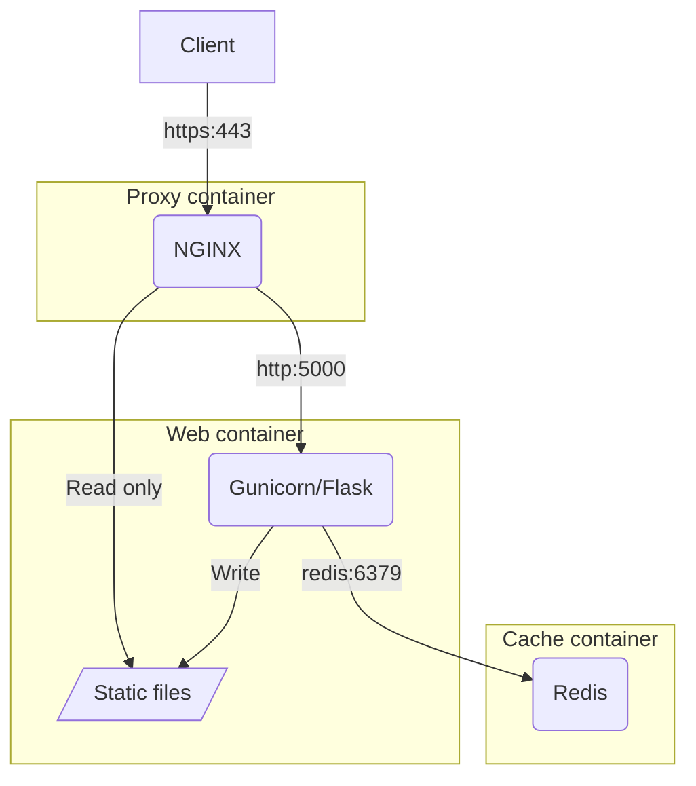

# Developing GOV.UK services with Python

<!-- more -->

```mermaid
flowchart TB
    cache1(Redis)
    Client
    prox1(NGINX)
    web1(Gunicorn/Flask)
    web2[/Static files/]

    Client -- https:443 --> prox1 -- http:5000 --> web1
    prox1 -- Read only --> web2
    web1 -- Write --> web2
    web1 -- redis:6379 --> cache1

    subgraph Proxy container
        prox1
    end

    subgraph Web container
        web1
        web2
    end

    subgraph Cache container
        cache1
    end
```