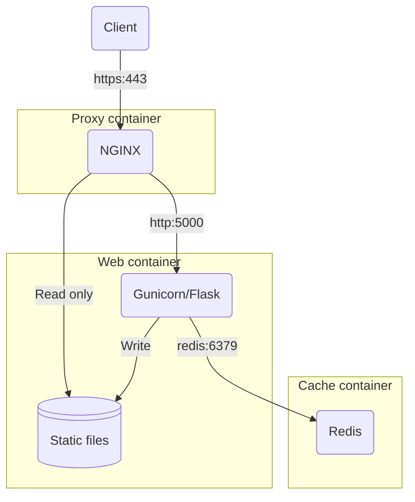

# Developing GOV.UK services with Python


For those of us building digital services for GOV.UK, you'll find that most of the available resources, from frontend frameworks, to templating and prototyping kits, are based around a JavaScript centric stack. But if you want to build web apps using [Python](https://www.python.org/) for GOV.UK your options are more limited.

<!-- more -->

If you're a Python developer, there's a good chance you've heard of [Flask](https://flask.palletsprojects.com/en/stable/). Flask is an excellent microframework suitable for building UIs and APIs that are lightweight, unopinionated and extensible. With Python being the third most popular language in the [2024 Stack Overflow Developer Survey](https://survey.stackoverflow.co/2024/technology/#most-popular-technologies), it's easy to see why developers chose Flask as the framework for their projects.

## A brief history

While working at [HM Land Registry](https://www.gov.uk/government/organisations/land-registry) in 2017, my colleague [Andy Mantell](https://github.com/andymantell) and I were developing a GOV.UK service using a Python and Flask stack. Andy did the original development work on a direct port of the [GOV.UK Frontend](https://frontend.design-system.service.gov.uk/) macros, transforming them from their Nunjucks originals, into [Jinja](https://jinja.palletsprojects.com). Alongside this, a number of [WTForms](https://wtforms.readthedocs.io) widgets were created which use these Jinja macros to render and validate GOV.UK styled forms.

This code was used internally throughout the organisation for several years, underpinning several citizen facing services on GOV.UK, as well as other professional and internal services, with great success. I was fortunate enough to take over the ownership and maintenance of that codebase following Andy's departure and have spent the last few years supporting and enhancing it. One of the first things I did was to take the closed-source code, turn it into installable Python packages, make the code open-source and publish the packages publicly on [PyPI](https://pypi.org/), for anyone across government to use.

In this blog I'd like to explore those packages, how they combine to help you build GOV.UK services quicker and easier, and share some best practices that I've learned along the way.

## GOV.UK Frontend Jinja


[GOV.UK Frontend Jinja](https://github.com/LandRegistry/govuk-frontend-jinja) is a Python package that integrates the [GOV.UK Design System](https://design-system.service.gov.uk/) with the [Jinja](https://jinja.palletsprojects.com/en/stable/) templating engine. The package provides a set of reusable components that help developers to build user interfaces for government services quickly and in compliance with the GOV.UK design principles.

An [automated test tool](https://github.com/matthew-shaw/govuk-frontend-diff) performs a diff between the HTML generated by the Jinja templates, against the HTML generated by the original Nunjucks templates. This uses the original GOV.UK Frontend test fixtures to [exercise 665 test scenarios](https://github.com/LandRegistry/govuk-frontend-jinja/actions/workflows/python-package.yml) that render every component in every possible configuration, so I have complete confidence in the quality and accuracy of the output.

At the time of writing, GOV.UK Frontend Jinja is being used in [138 code repositories](https://github.com/LandRegistry/govuk-frontend-jinja/network/dependents), including in 11 government departments:

- [Active Travel England](https://github.com/acteng)
- [Central Digital and Data Office](https://github.com/co-cddo)
- [Crown Commercial Service](https://github.com/Crown-Commercial-Service)
- [Department for Business and Trade](https://github.com/uktrade)
- [Department for Business, Energy and Industrial Strategy](https://github.com/UKGovernmentBEIS)
- [Government Digital Service](https://github.com/alphagov)
- [HM Land Registry](https://github.com/LandRegistry)
- [Incubator for Artificial Intelligence](https://github.com/i-dot-ai)
- [Ministry of Housing, Communities and Local Government](https://github.com/communitiesuk)
- [Ministry of Justice](https://github.com/ministryofjustice)
- [The National Archives](https://github.com/nationalarchives)

### Benefits

- **Consistency with GOV.UK Design Standards**: The package ensures services align with the GOV.UK Design System’s visual and interaction guidelines, maintaining accessibility, usability, and a consistent user experience across government services.
- **Direct Nunjucks Macro Porting**: Each component directly mirrors the Nunjucks macros from the [GOV.UK Frontend](https://frontend.design-system.service.gov.uk/).
- **Seamless Integration with Jinja Templates**: The package simplifies incorporating GOV.UK Design System components into Python web frameworks (e.g., Flask, Django) using Jinja templates, eliminating the need for manual HTML, CSS, or JavaScript implementation.
- **Improved Accessibility**: The package ensures compliance with WCAG standards, meeting legal and ethical requirements and helping make public sector services more inclusive for all users.
- **Time-Saving**: Pre-built components like headers, footers, and buttons can be easily customized and reused, saving development time by avoiding the need to build components from scratch.
- **Promotes Best Practices**: The package supports adherence to frontend development best practices and government digital service standards, aiding in compliance with guidelines.

### Usage

Integrating into a Flask application is simple. First add `govuk-frontend-jinja` to your project dependencies; I prefer to use the requirements file format for this:

```title="requirements.in" linenums="1"
flask==3.1.0
govuk-frontend-jinja==3.4.1
```

Then compile the top-level dependencies into the familiar `requirements.txt` file using [pip-tools](https://pip-tools.readthedocs.io/en/latest/):

```shell
pip-compile requirements.in --upgrade
```

And install them:

```shell
pip install -r requirements.txt
```

I'm not using a `venv` here, because I'm going to use Docker to isolate runtime dependencies later on. Then, in the application initialisation (typically a `create_app()` method in `__init__.py` if using the [application factory pattern](https://flask.palletsprojects.com/en/stable/patterns/appfactories/)):

```python title="app/__init__.py" linenums="1"
from flask import Flask
from jinja2 import ChoiceLoader, PackageLoader, PrefixLoader

def create_app():
    app = Flask(__name__)
    app.jinja_loader = ChoiceLoader(
        [
            PackageLoader("app"),
            PrefixLoader(
                {
                    "govuk_frontend_jinja": PackageLoader("govuk_frontend_jinja")
                }
            ),
        ]
    )

    return app
```

## GOV.UK Frontend WTForms


[GOV.UK Frontend WTForms](https://github.com/LandRegistry/govuk-frontend-wtf) is a Python package that integrates the [GOV.UK Design System](https://design-system.service.gov.uk/) with the [WTForms](https://wtforms.readthedocs.io) library. The package allows developers to quickly create forms styled according to the GOV.UK Design System principles, using the familiar WTForms API to streamline the development process, and promote best practices in building government services.

### Benefits

- **Seamless Integration with WTForms**: WTForms is a popular library for handling forms in Python-based web frameworks. GOV.UK Frontend WTForms enhances WTForms by automatically styling form elements using GOV.UK Frontend Jinja macros, making it easy to create well-structured, consistent forms.
- **Consistency with GOV.UK Design Standards**: Forms generated with GOV.UK Frontend WTForms follow the visual and interaction design patterns of the GOV.UK Design System, ensuring that your forms look and behave the same as other government services, providing a familiar and intuitive experience for users that is optimised for usability, clarity, and legal compliance.
- **Input validation**: Fine grained input validation, such as length checks, type checks and custom validation logic. This built-in validation helps prevent malicious input from being processed, reducing the risk of attacks like SQL injection and XSS by ensuring that data input by the user is properly sanitised and validated.
- **Customizable and Extensible**: While it provides default components styled according to GOV.UK guidelines, GOV.UK Frontend WTForms can be customised to meet specific needs, enabling developers to tailor form elements, validation messages, and other details as required.
- **CSRF protection**: Leverages WTForms automatic CSRF protection. This means that each form automatically includes a CSRF token, which prevents unauthorised form submissions by attackers trying to exploit a user's session.

### Usage

```python title="app/__init__.py" linenums="1" hl_lines="2 13 19 20"
from flask import Flask
from govuk_frontend_wtf.main import WTFormsHelpers
from jinja2 import ChoiceLoader, PackageLoader, PrefixLoader

def create_app(config_class=Config):
    app = Flask(__name__)
    app.jinja_loader = ChoiceLoader(
        [
            PackageLoader("app"),
            PrefixLoader(
                {
                    "govuk_frontend_jinja": PackageLoader("govuk_frontend_jinja"),
                    "govuk_frontend_wtf": PackageLoader("govuk_frontend_wtf"),
                }
            ),
        ]
    )

    # Initialise app extensions
    WTFormsHelpers(app)

    return app
```

```python title="app/demos/forms.py" linenums="1" hl_lines="2 10 19"
from flask_wtf import FlaskForm
from govuk_frontend_wtf.wtforms_widgets import GovSubmitInput, GovTextInput
from wtforms import StringField, SubmitField
from wtforms.validators import Email, InputRequired, Length


class ExampleForm(FlaskForm):
    email_address = StringField(
        "Email address",
        widget=GovTextInput(),
        validators=[
            InputRequired(message="Enter an email address"),
            Length(max=256, message="Email address must be 256 characters or fewer"),
            Email(message="Enter an email address in the correct format, like name@example.com"),
        ],
        description="We’ll only use this to send you a receipt",
    )

    submit = SubmitField("Continue", widget=GovSubmitInput())
```

## GOV.UK Frontend Flask

The GOV.UK Frontend Flask template application is a starter project that demonstrates how to build GOV.UK services with the Flask web framework. It provides a well structured and ready-to-use template that showcases how to build web applications that comply with the GOV.UK design standards, ensuring that government services maintain consistency, accessibility, and usability.

### Benefits

- **Rapid Development**: The pre-configured Flask setup speeds up development, allowing developers to focus on features instead of boilerplate code.
- **Separation of Logic and UI**: Using Flask with Jinja ensures clear separation of logic and presentation, making the code easier to maintain, test, and scale.
- **Faster Onboarding**: New developers can quickly adapt to the GOV.UK Design System with this clean, guideline-compliant template, reducing the learning curve.
- **Open Source and Customizable**: The open-source nature allows easy modification and customization, while ensuring adherence to GOV.UK standards.
- **Community and Support**: A large community and extensive documentation provide quick solutions and best practices for developers.
- **Easy Deployment**: The template simplifies deployment to cloud platforms like Heroku, ensuring smooth production scaling.

### Architecture



### Security

### Performance

## Conclusion

This blog covered how to build GOV.UK services using Python and Flask while following best practices for:

- Templates with GOV.UK Frontend Jinja
- Forms with WTForms integration
- Security and performance optimisation
- Container-based deployment architecture

The provided packages make it quick and easy to create compliant GOV.UK services while maintaining high standards for accessibility, security and performance.

All code is open source and available on GitHub:

- [GOV.UK Frontend Jinja](https://github.com/LandRegistry/govuk-frontend-jinja)
- [GOV.UK Frontend WTForms](https://github.com/LandRegistry/govuk-frontend-wtf)
- [GOV.UK Frontend Flask](https://github.com/LandRegistry/govuk-frontend-flask)

---

[:fontawesome-brands-bluesky: Share on Bluesky](https://bsky.app/intent/compose?text={{ page.title | urlencode }} by @mash85.bsky.social {{ page.canonical_url }} %23{{ tag | replace(" ", "") }} ){ .md-button .md-button--primary }

[:fontawesome-brands-linkedin: Share on LinkedIn](https://www.linkedin.com/sharing/share-offsite/?url={{page.canonical_url}}){ .md-button .md-button--primary }

[:fontawesome-brands-x-twitter: Share on Twitter](https://twitter.com/intent/tweet?text={{ page.title | urlencode }}&url={{ page.canonical_url }}&hashtags={{ tag | replace(" ", "") }},&via=MattShaw85){ .md-button .md-button--primary }
