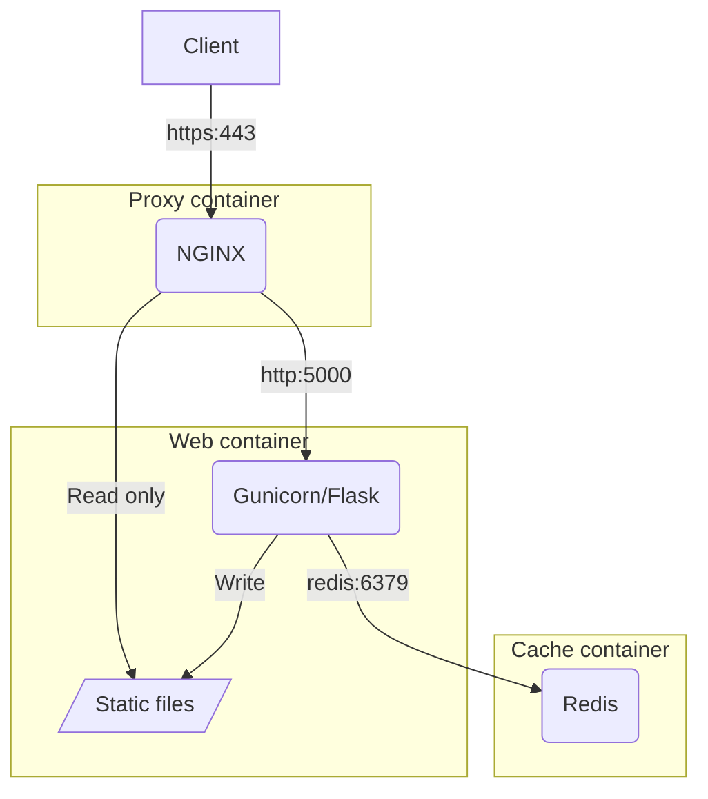

# Developing GOV.UK services with Python

<!-- more -->

## A brief history

In 2016 I was working on the beta version of a new GOV.UK service at [HM Land Registry](https://www.gov.uk/land-registry) that would go on to become ["Search for Land and Property Information"](https://search-property-information.service.gov.uk/).

## Templates

## Forms

## Security

## Performance

## Architecture

