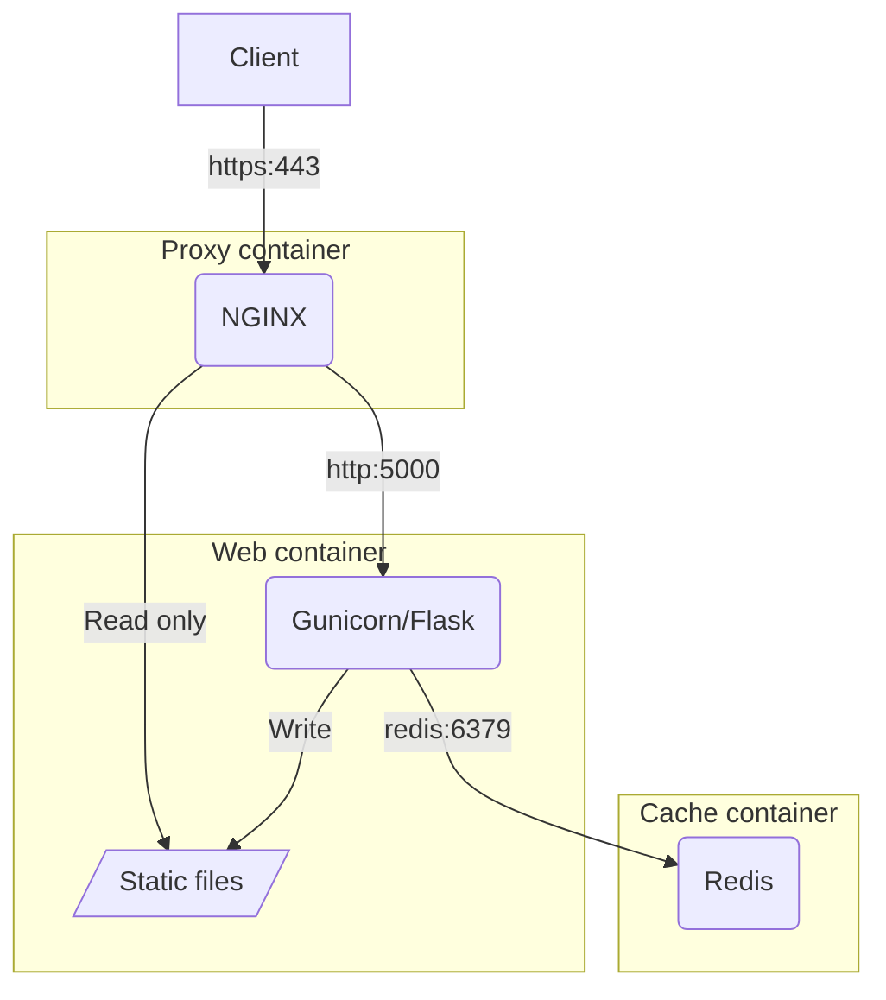

# Developing GOV.UK services with Python

For those of us building digital services for GOV.UK, you'll find that most of the available resources, from frontend frameworks, to templating and prototyping kits, are based around a JavaScript centric stack. But if you want to build web apps using Python for GOV.UK your options are more limited.

<!-- more -->

If you're a Python developer, there's a good chance you've heard of Flask. Flask is an excellent microframework suitable for building UIs and APIs that are lightweight, unopinionated and extensible. With Python being the third most popular language in the [2024 Stack Overflow Developer Survey](https://survey.stackoverflow.co/2024/technology/#most-popular-technologies), it's easy to see why developers chose Flask as the framework for their projects.

## A brief history

When working at [HM Land Registry](https://www.gov.uk/government/organisations/land-registry) in 2017, my colleague [Andy Mantell](https://github.com/andymantell) and I were developing a GOV.UK service in a Python and Flask stack. Andy undertook the original development work on a direct port of the [GOV.UK Frontend](https://frontend.design-system.service.gov.uk/) macros, transforming them from their Nunjucks originals, into [Jinja](https://jinja.palletsprojects.com). Alongside this, a number of [WTForms](https://wtforms.readthedocs.io) widgets were created which use these Jinja macros to render and validate GOV.UK styled forms.

This code was used internally throughout the organisation for several years, underpinning several citizen facing services on GOV.UK, as well as other professional and internal services with great success. I was fortunate enough to take over the ownership and maintenance of that codebase following Andy's departure and have spent the last few years maintaining and enhancing it. One of the first things I did was to take the closed source code, turn it into installable Python packages and make the code open source for anyone across government to use.

In this blog I'd like to explore what those packages are, how they combine to help you build GOV.UK services quicker and easier, and share some best practices that I've learned along the way.

## Templates

The [GOV.UK Frontend Jinja](https://github.com/LandRegistry/govuk-frontend-jinja) package provides a like-for-like port of the original Nunjucks macros from [GOV.UK Frontend](https://frontend.design-system.service.gov.uk/). Since Nunjucks is heavily inspired by Jinja, most of the syntax is the same, which enables a key design choice to aim for 100% equivalency. As as result, you can take any of the [GOV.UK Design System component](https://design-system.service.gov.uk/components/) macros and use them exactly as-is in a Flask project.

## Forms

## Applications

## Security

## Performance

## Architecture

