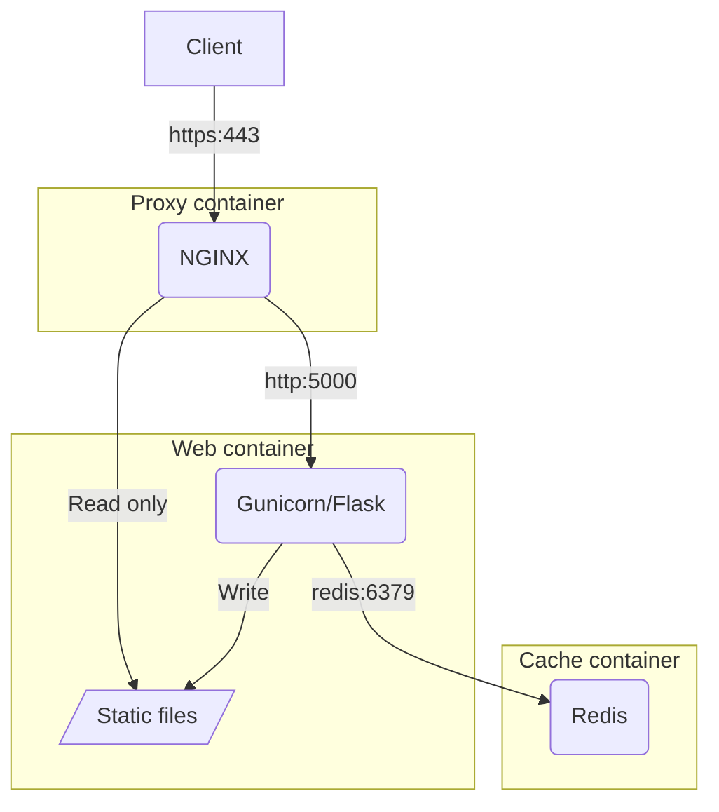

# Developing GOV.UK services with Python

For those of us building digital services for GOV.UK, you'll find that most of the available resources, from frontend frameworks, to templating and prototyping kits, are based around a JavaScript centric stack. But if you want to build web apps using [Python](https://www.python.org/) for GOV.UK your options are more limited.

<!-- more -->

If you're a Python developer, there's a good chance you've heard of [Flask](https://flask.palletsprojects.com/en/stable/). Flask is an excellent microframework suitable for building UIs and APIs that are lightweight, unopinionated and extensible. With Python being the third most popular language in the [2024 Stack Overflow Developer Survey](https://survey.stackoverflow.co/2024/technology/#most-popular-technologies), it's easy to see why developers chose Flask as the framework for their projects.

## A brief history

While working at [HM Land Registry](https://www.gov.uk/government/organisations/land-registry) in 2017, my colleague [Andy Mantell](https://github.com/andymantell) and I were developing a GOV.UK service using a Python and Flask stack. Andy did the original development work on a direct port of the [GOV.UK Frontend](https://frontend.design-system.service.gov.uk/) macros, transforming them from their Nunjucks originals, into [Jinja](https://jinja.palletsprojects.com). Alongside this, a number of [WTForms](https://wtforms.readthedocs.io) widgets were created which use these Jinja macros to render and validate GOV.UK styled forms.

This code was used internally throughout the organisation for several years, underpinning several citizen facing services on GOV.UK, as well as other professional and internal services, with great success. I was fortunate enough to take over the ownership and maintenance of that codebase following Andy's departure and have spent the last few years supporting and enhancing it. One of the first things I did was to take the closed-source code, turn it into installable Python packages, make the code open-source and publish the packages publicly on [PyPI](https://pypi.org/), for anyone across government to use.

In this blog I'd like to explore those packages, how they combine to help you build GOV.UK services quicker and easier, and share some best practices that I've learned along the way.

## Templates

The [GOV.UK Frontend Jinja](https://github.com/LandRegistry/govuk-frontend-jinja) package provides a like-for-like port of the original Nunjucks macros from [GOV.UK Frontend](https://frontend.design-system.service.gov.uk/). Since Nunjucks is heavily inspired by Jinja, most of the syntax is the same, which enables a key design choice to aim for 100% equivalency. As as result, you can take any of the [GOV.UK Design System component](https://design-system.service.gov.uk/components/) macros and use them exactly as-is in a Flask project.

By following a TDD approach I can ensure the quality and accuracy of the output. Andy created an [automated test tool](https://github.com/matthew-shaw/govuk-frontend-diff) to perform a diff between the HTML generated by the Jinja templates, against the HTML generated by the original Nunjucks templates. This uses the original GOV.UK Frontend test fixtures to [exercise 665 test scenarios](https://github.com/LandRegistry/govuk-frontend-jinja/actions/workflows/python-package.yml) that render every component in every possible configuration, so I have complete confidence that the HTML produced is identical.

At the time of writing, GOV.UK Frontend Jinja is being used in [125 code repositories](https://github.com/LandRegistry/govuk-frontend-jinja/network/dependents), including in 11 government departments:

- [Active Travel England](https://github.com/acteng)
- [Central Digital and Data Office](https://github.com/co-cddo)
- [Crown Commercial Service](https://github.com/Crown-Commercial-Service)
- [Department for Business and Trade](https://github.com/uktrade)
- [Department for Business, Energy and Industrial Strategy](https://github.com/UKGovernmentBEIS)
- [Government Digital Service](https://github.com/alphagov)
- [HM Land Registry](https://github.com/LandRegistry)
- [Incubator for Artificial Intelligence](https://github.com/i-dot-ai)
- [Ministry of Housing, Communities and Local Government](https://github.com/communitiesuk)
- [Ministry of Justice](https://github.com/ministryofjustice)
- [The National Archives](https://github.com/nationalarchives)

### Usage

Integrating into a Flask application is simple. First add `govuk-frontend-jinja` to your project dependencies; I prefer to use the requirements file format for this:

```title="requirements.in" linenums="1"
flask==3.0.3
govuk-frontend-jinja==3.4.0
```

Then compile the top-level dependencies into the familiar `requirements.txt` file using [pip-tools](https://pip-tools.readthedocs.io/en/latest/):

```shell
pip-compile requirements.in --upgrade
```

And install them:

```shell
pip install -r requirements.txt
```

I'm not using a `venv` here, because I'm going to use Docker to isolate runtime dependencies later on. Then, in the application initialisation (typically a `create_app()` method in `__init__.py` if using the [application factory pattern](https://flask.palletsprojects.com/en/stable/patterns/appfactories/)):

```python title="app/__init__.py" linenums="1"
from flask import Flask
from jinja2 import ChoiceLoader, PackageLoader, PrefixLoader

def create_app():
    app = Flask(__name__)
    app.jinja_loader = ChoiceLoader(
        [
            PackageLoader("app"),
            PrefixLoader(
                {
                    "govuk_frontend_jinja": PackageLoader("govuk_frontend_jinja")
                }
            ),
        ]
    )

    return app
```

## Forms

The GOV.UK Frontend WTForms package provides a set of WTForms widgets used to render form fields using the GOV.UK Frontend components in GOV.UK Frontend Jinja. Associated error messages are rendered in the appropriate place, along with the error summary component and all related accessibility ARIA attributes. By simply adding a widget to the form class you get far simpler templates, which makes it quick and easy to produce fully GOV.UK compliant forms.

### Usage

```python title="app/__init__.py" linenums="1" hl_lines="2 13 19 20"
from flask import Flask
from govuk_frontend_wtf.main import WTFormsHelpers
from jinja2 import ChoiceLoader, PackageLoader, PrefixLoader

def create_app(config_class=Config):
    app = Flask(__name__)
    app.jinja_loader = ChoiceLoader(
        [
            PackageLoader("app"),
            PrefixLoader(
                {
                    "govuk_frontend_jinja": PackageLoader("govuk_frontend_jinja"),
                    "govuk_frontend_wtf": PackageLoader("govuk_frontend_wtf"),
                }
            ),
        ]
    )

    # Initialise app extensions
    WTFormsHelpers(app)

    return app
```

```python title="app/demos/forms.py" linenums="1" hl_lines="2 10 19"
from flask_wtf import FlaskForm
from govuk_frontend_wtf.wtforms_widgets import GovSubmitInput, GovTextInput
from wtforms import StringField, SubmitField
from wtforms.validators import Email, InputRequired, Length


class ExampleForm(FlaskForm):
    email_address = StringField(
        "Email address",
        widget=GovTextInput(),
        validators=[
            InputRequired(message="Enter an email address"),
            Length(max=256, message="Email address must be 256 characters or fewer"),
            Email(message="Enter an email address in the correct format, like name@example.com"),
        ],
        description="We’ll only use this to send you a receipt",
    )

    submit = SubmitField("Continue", widget=GovSubmitInput())
```

## Applications

### Architecture



## Security

## Performance

---

[:fontawesome-brands-bluesky: Share on Bluesky](https://bsky.app/intent/compose?text={{ page.title }} by @mash85.bsky.social {{ page.canonical_url | urlencode }} %23{{tag}} ){ .md-button .md-button--primary }

[:fontawesome-brands-x-twitter: Share on Twitter](https://twitter.com/intent/tweet?text={{ page.title }}&url={{ page.canonical_url | urlencode }}&hashtags={{tag}},&via=MattShaw85){ .md-button .md-button--primary }
