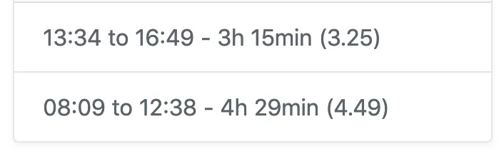
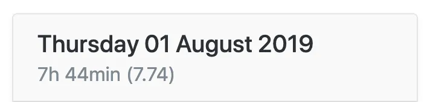
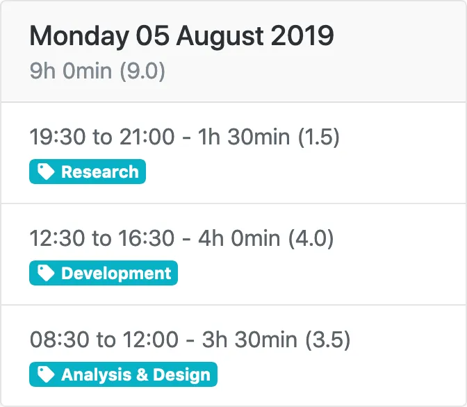

---
date:
  created: 2019-08-09
authors:
  - mash
categories:
  - Software Development
  - Mash Software
description: Some of the ways that using The Button makes recording your time simpler, easier and quicker.
tags:
  - Bootstrap
  - Flask
  - PostgreSQL
  - Python
  - Redis
  - SQLAlchemy
  - WTForms
---

# The Button — Time Tags

Since [introducing “The Button”](mash-button-intro.md) last month there have been two [releases](https://github.com/MashSoftware/time-tracker/releases) to production. The first was a large scale [refactoring](https://en.wikipedia.org/wiki/Code_refactoring) of the app, to improve the structure of the code and make it easier to add new features in future. The second release is what I want to share today; a new feature!

<!-- more -->

Before that though, I want to highlight some of the ways that using [The Button](https://time-tracker.mashsoftware.com/) makes recording your time simpler, easier and quicker.

## Keep it simple

Using [The Button](https://time-tracker.mashsoftware.com/) is super easy. I leave the app open in a browser on my phone and as I walk into work each morning I tap the start button. Because it’s quick and simple, I remember to do it. No more trying to work out what time I got in, or typing into spreadsheets, or writing notes that I then lose. If for some reason I forget to tap the start button on my phone, then I can also do it from my laptop.

And because I tap to start and stop when I arrive and leave I also know that my times are accurate. [The Button](https://time-tracker.mashsoftware.com/) records time down to fractions of seconds but displays time in a clear and readable format to assure you that they’re right.

{ width="600" }

If you have to use a corporate time reporting system, such as those from Oracle or SAP, then [The Button](https://time-tracker.mashsoftware.com/) helps to make this as painless as possible. I used to type in many start and end times in every day using a slow and awkward system. Now by using the quick, simple and intuitive interface of [The Button](https://time-tracker.mashsoftware.com/), it’s all worked out for me. I copy a single number of decimal hours and that’s it, done!

{ width="600" }

## Tag, you’re it!

As mentioned in [my last blog](mash-button-intro.md), one of the first features I wanted to add was the ability to categorise time entries. I’ve implemented this using the concept of tags.

{ width="600" }

Tags are short descriptions of some kind of activity; anything that you want to record, measure or track. They could be whole projects or individual tasks at work for example. Tags are optional, new time entries are created without an associated tag. You can edit the entry to tag it afterwards, if you want to.

{ width="600" }

Users can create, update and delete up to five unique tags. Tags are personal to each user and not shared between accounts. If you delete a tag it will not delete any associated entries, only remove the link between them.

If you need to account for your time spent on various projects then using tags helps you to quickly allocate time to each project.

## What’s next?

Going back to my original wishlist, the next feature should be to keep a running balance of flexible working time. But I’m not satisfied that I could deliver that whilst still maintaining my core design principle of _simplicity_. However, I can do a part of that functionality; to calculate a daily credit/debit amount based on a user-defined schedule. This way I can deliver value to users whilst still considering the best way to simplify the remaining part.

I hope you find that using tags is another way that [The Button](https://time-tracker.mashsoftware.com/) helps you to simplify your time management and recording. If you haven’t signed up yet please try using [The Button](https://time-tracker.mashsoftware.com/) for yourself and let me know your feedback, [issues or feature requests](https://github.com/MashSoftware/time-tracker/issues/new/choose).

Thanks for reading!

---

[:fontawesome-brands-bluesky: Share on Bluesky](https://bsky.app/intent/compose?){ .md-button .md-button--primary }

[:fontawesome-brands-x-twitter: Share on Twitter](https://twitter.com/intent/tweet?){ .md-button .md-button--primary }
