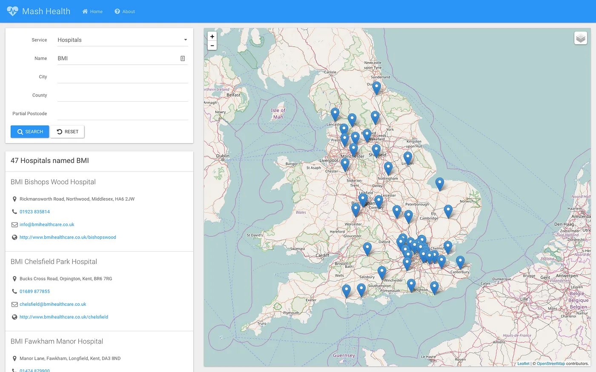
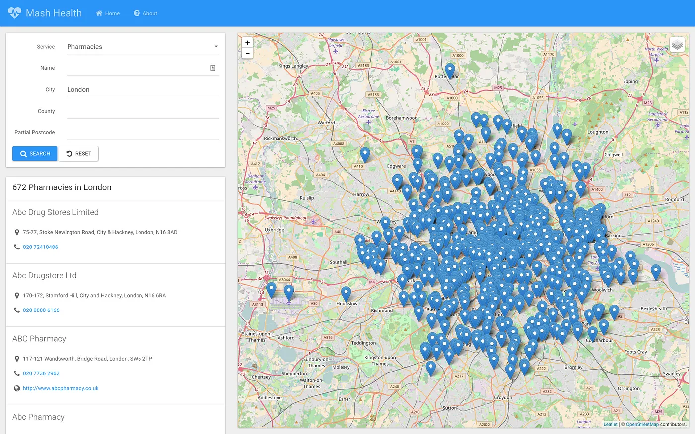
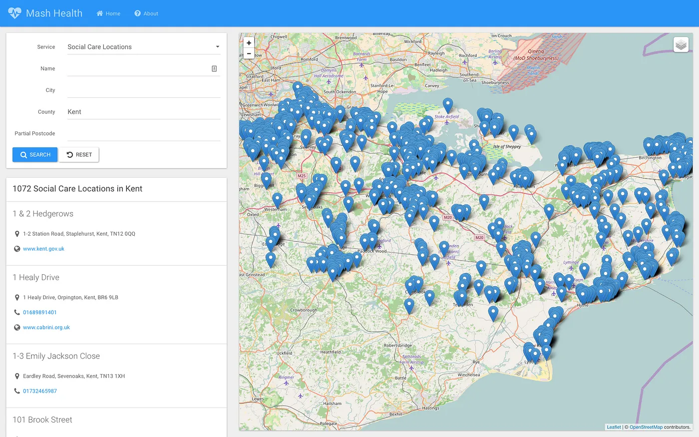
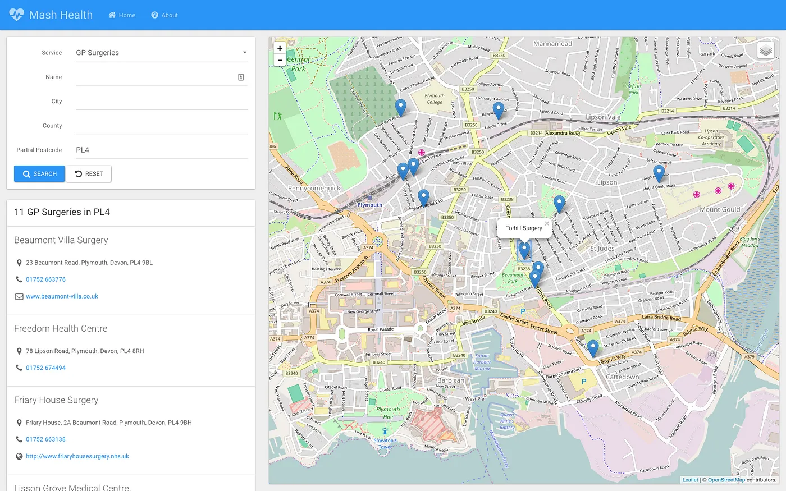

---
date:
  created: 2016-10-18
authors:
  - mash
categories:
  - Software Development
  - Mash Software
description: A digital public service that enables users to find UK healthcare providers.
tags:
  - Bootstrap
  - Flask
  - Open Data
  - Python
---

# Mash Health

Mash Health is a digital public service that enables users to find UK healthcare providers. It uses the [data.gov.uk API](https://data.gov.uk/data/api/health) to access healthcare information for a variety of service types, including hospitals, GP surgeries, pharmacies, clinics and social care.

<!-- more -->

It allows for easy searching by name, city, county or partial postcode. Results are displayed in a clear list with all relevant contact information and also displayed on an interactive map.

{ width="600" }

## Open Data API

I’m all for government open data on data.gov.uk, it’s important that it’s published in the public domain for transparency and to encourage re-use and innovation. However, part of the problem is unless you want to download that data, process it, host it, load a database etc, it’s not as easily usable for a developer as it is to someone who just wants to view it. The **availability** of the data on data.gov.uk is high, the ease of **re-use** is, in my opinion, low.

That’s why it’s great that there is now programatic access to some datasets over a common protocol (HTTP), using standard interfaces (RESTful API) and serving open data in open standard formats (JSON). Many thanks to [Ross Jones](https://mastodon.social/@rossjones) for his help in answering a few questions for me and taking my feedback on the API so far. I look forward to seeing and using many more data.gov.uk APIs in future!

{ width="600" }

## Design Principles

I wanted to see what I could do to present healthcare open data in a useful, engaging and interesting way.

- Firstly, I wanted to visualise the data on a map, to see how healthcare locations are geographically distributed, as such it takes up the lions share of the page.
- Secondly, theres a lot of different contact information for healthcare providers available; it should be easy to identify and use.
- Thirdly, you should be able to search for different types of healthcare providers in a consistent and structured way, in order to aid the ease of finding what you need.
- Lastly, it should work well on a mobile device, so the design must be responsive and links to contact details should open appropriate apps (like a phone number).

The last point was a bit tricky with the map, since a [slippy map](https://wiki.openstreetmap.org/wiki/Slippy_map) that occupies the width of the screen can give users issues with scrolling past it, so my solution was to remove it and focus on the textual result data. If you’re using a tablet in landscape orientation, or a regular desktop resolution, then the added screen estate makes the experience a better one, without inhibiting the mobile device experience.

{ width="600" }

## What’s next?

This is an ongoing project, driven by user needs and feedback. Here are a few of the ideas I’d like to implement:

- Search based on geolocation.
- Search for all types of healthcare service at once.
- Identify different healthcare service types with custom map markers
- Add satellite imagery map base layer
- Link between clicking on a result in the list and highlighting on the map and vice versa
- Give it a proper URL on my domain! (I’ll do this shortly)

{ width="600" }

I’d really appreciate any feedback on the service so far, including feature requests and bug reports, so please feel free to contact me, or raise an issue on [GitHub](https://github.com/MashSoftware/health).

In the meantime, please give Mash Health a try and let me know what you think of it.

---

[:fontawesome-brands-x-twitter: Share on Twitter](https://twitter.com/intent/tweet?url=https%3A%2F%2Fmatthew-shaw.github.io%2Fblog%2F2016%2F10%2F18%2Fmash-health%2F&via=MattShaw85&text=Mash%20Health&hashtags=OpenData%2CPython%2CFlask){ .md-button .md-button--primary }
