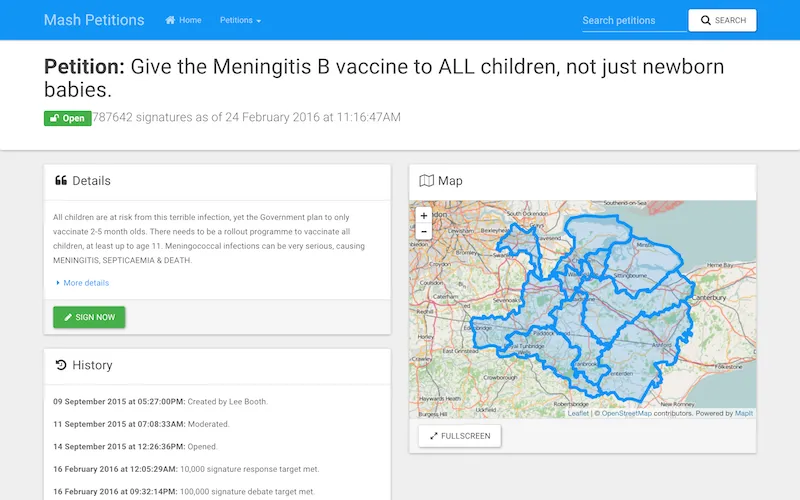
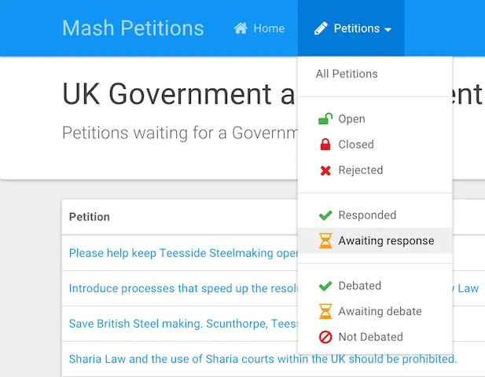
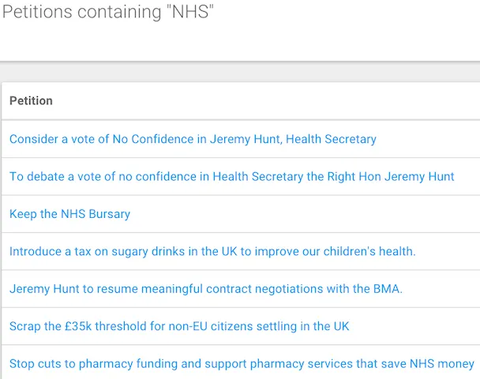
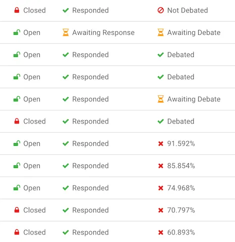
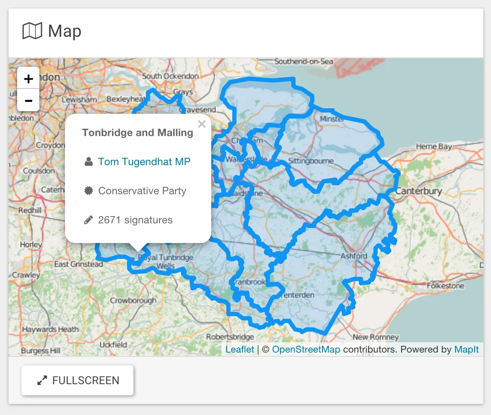
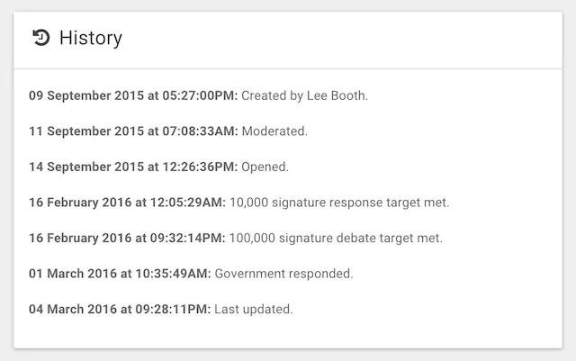
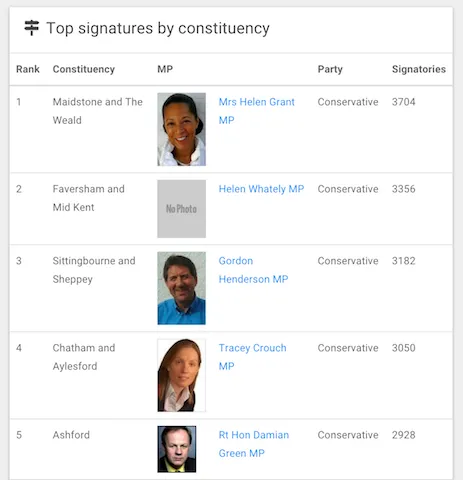

---
date:
  created: 2016-03-05
authors:
  - mash
categories:
  - Software Development
  - Mash Software
description: A digital public service that enables users to explore UK government and parliament petitions.
tags:
  - Bootstrap
  - Flask
  - Maps
  - Open Data
  - Python
---

# Mash Petitions

Mash Petitions is a digital public service that enables users to explore UK parliament petitions. It builds upon the governments' e-petitions platform, exposes more detailed information and combines it with other open public data to enable interesting analysis and insight.

<!-- more -->

{ width="600" }

## What it isn't

It is not a way to sign or create official government petitions, nor a replacement for any feature of the government e-petitions service at <https://petition.parliament.uk/>. It is not a government service and makes no attempts to appear as such, it just uses open data from a government service, for which full attribution, licensing and credit is given.

## Why?

Mash Petitions is free, as in free speech, not as in free beer. It is intended for the greater civil and democratic good. It promotes greater transparency of the operations of government and parliament in responding to the requests of its' citizens. It enables citizens to view which members of parliament represent them and the causes they care about in their constituencies. It allows for quick, easy and simple comparison of petitions and their progress through the democratic process. It visualises geographic data so that local issues can be identified and understood.

## Principles

I set out developing Mash Petitions with a few design principles in mind:

### More detailed information, displayed clearly and simply

There is a lot more information about the history and demographics of a petition available through the e-petitions API than is displayed on the petitions' web page. I wanted to show this information, but make it clear and simple to understand. I also wanted it to be easier to compare progression towards milestones between petitions by displaying them in a clear tabular format and allow them to be filtered by state and search criteria.

### Visualise geographical data on a map

Data about signatories parliamentary constituency is not provided in a geospatial format by e-petitions. Displaying this spatial data visually can show strong correlations between petitions and geographic locations. This can be for many reasons, including proximity to a local cause, a large population of people affected by an issue, socioeconomic status, political alignment, environmental disaster and many more. If a picture paints a thousand words, a map paints a million.

### Responsive web design

This service is about a function of government that serves all of its' citizens. Therefore it should absolutely work on the wide variety of devices of different shapes, sizes and capabilities that citizens use, including smartphones, tablets, laptops, desktops and TV's. I believe that creating responsive web services is a better approach than native apps as the barrier to entry is much lower (any device with a web browser) and the potential reach far higher.

### Make it better

When I discovered there was an API for e-petitions, my first thoughts were "I bet I can make something good with that!". Ultimately that's all it comes down to, I wanted to make something useful and show open public data in an interesting and clear way that benefits citizens and their interactions with government. I thought I could make it better, so I've tried to do that.

## Features

Filter petitions by status:

{ width="600" }

Search full text of petitions:

{ width="600" }

Make easy comparisons with clear status and progress indicators:

{ width="600" }

Interactive maps with fullscreen view:

{ width="600" }

View complete history of a petition:

{ width="600" }

Signatures by constituency with MP details and link to their [TheyWorkForYou](https://www.theyworkforyou.com/) profile:

{ width="600" }

## Open Beta

This is not finished and probably never will be. It's work in progress and driven by user needs. I want to put it out into the hands of the public to see if it works for them and to learn more about their needs. I can then use this feedback in order to iterate and improve it.

There might be bugs; if you find one please [raise an issue](https://github.com/MashSoftware/petitions/issues) so I can look into it.

If you have any feedback please get in touch and let me know. Alternatively, if you're a developer and want to contribute code you can do so on [GitHub](https://github.com/MashSoftware/petitions)

## Plans

Because of fair usage restrictions on some open data API's I am using there are some unfortunate limitations of my service. For example, I have had to limit getting MP details and geographical data to the top ten constituencies by signatures. I would like to be able to provide this information for all constituencies in future.

I also have more features planned to enable citizens to effectively lobby MP's to represent them and the causes they care about. I will be blogging about new features, fixes and improvements as and when they are live in the service, so keep an eye on my blog for updates.

In the meantime, please try using Mash Petitions and let me know what you think of it!

---

[:fontawesome-brands-bluesky: Share on Bluesky](https://bsky.app/intent/compose?text={{ page.title | urlencode }} by @mash85.bsky.social {{ page.canonical_url }} %23{{tag}} ){ .md-button .md-button--primary }

[:fontawesome-brands-x-twitter: Share on Twitter](https://twitter.com/intent/tweet?text={{ page.title | urlencode }}&url={{ page.canonical_url }}&hashtags={{tag}},&via=MattShaw85){ .md-button .md-button--primary }
