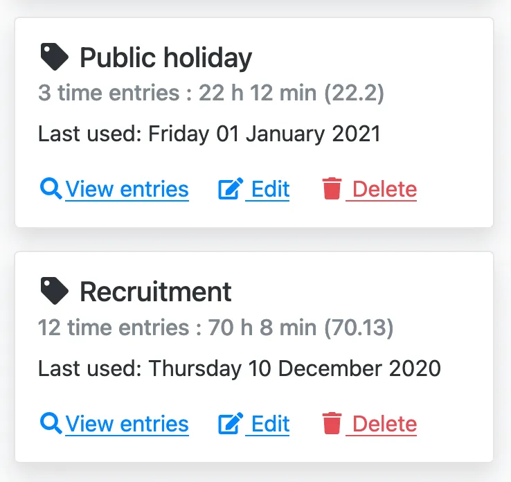
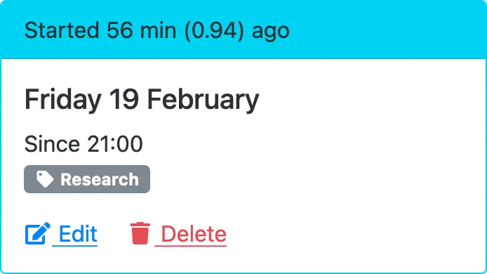
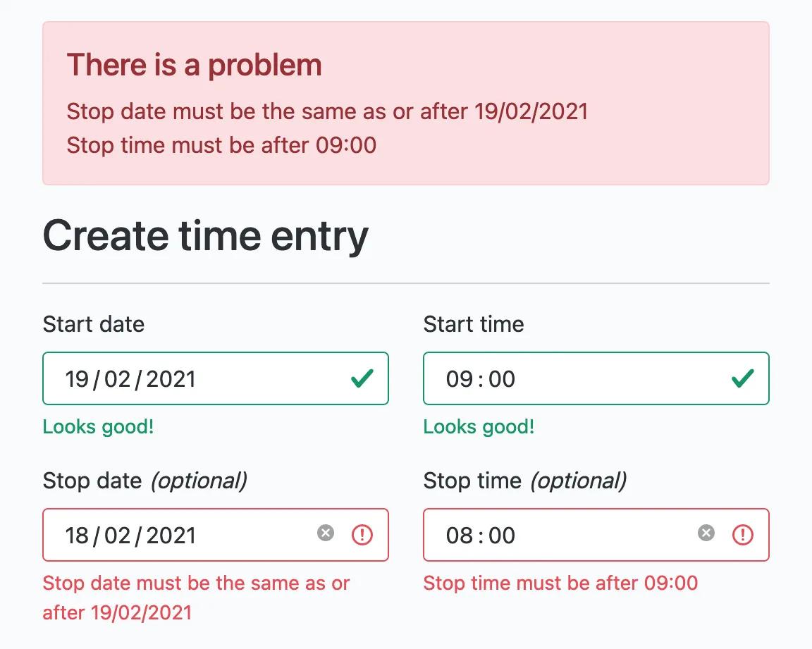
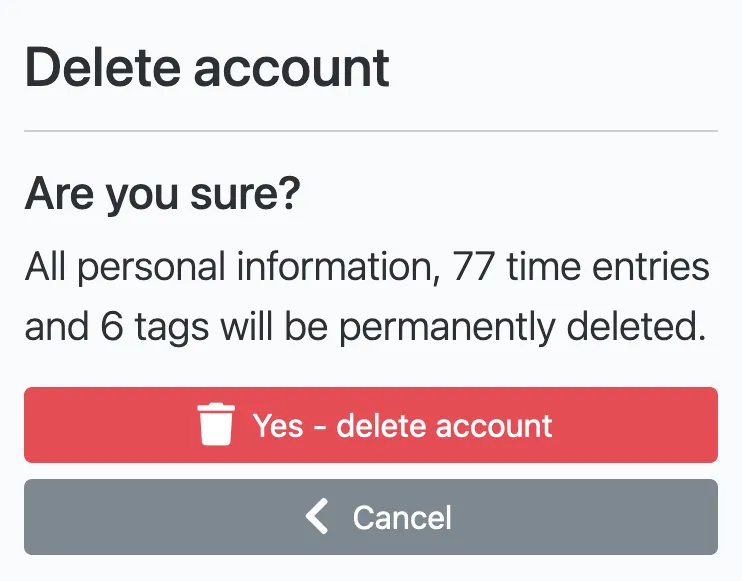

---
date:
  created: 2021-02-26
authors:
  - mash
categories:
  - Software Development
  - Mash Software
description: History retention, tag pages, in-progress duration & improved forms
tags:
  - Bootstrap
  - UX
  - WTForms
---

# Mash Time Tracker: History retention, tag pages, in-progress duration & improved forms

I'm rolling two releases together into this blog, since I wanted to get these features out sooner. I still think blogging is important way to commutate, but it was starting to become a blocking task, with some features done and ready to release but waiting for an associated blog post to be written. In future I'm taking the approach of releasing features more regularly and blogging about them when it reaches a significant amount of change.

<!-- more -->

## Time entry history

Up to now, each user had an limit of 120 time entries, enough for 2 entries per day, 5 days a week, for 12 weeks. Once that limit was reached then the oldest entry was deleted upon creating a new one. This means that each frequent user of the service would always have 120 entries stored, even if they then stopped using the service. At the small end of the scale this allows me to stay within low storage capacity limits and keep costs to a minimum. However, as the number of users increases the data capacity requirement increases linearly and therefore might start costing to retain inactive users historical data.

To resolve this I've removed the 120 time entry limit and replaced it with a 12 week retention period for all user accounts. This is managed by a scheduled task that runs every night at midnight (UTC) to delete all time entries started over 12 weeks ago. The account page has been updated to show the length, date and amount of history retained to keep users informed. Now, if a user stops using the service their time entry data will slowly be deleted, however their tags and account will always remain. This also gives me the option to explore variable data retention periods based on a subscription model in the future.

## Redesigned tag page and stats

{ width="600" }

The tag page has had an overhaul to highlight some insightful data. Each tag has it's own card showing the total number of tagged time entries and their total duration, along with the date that tag was last used.

You can also view all entries for that specific tag (from the last 12 weeks) if you needed to check or review all the times you spent doing a particular activity or working on a project. Tags displayed on time entry cards are now also clickable and link to all the tagged time entries page.

## In-progress time entry duration

{ width="600" }

Time entries that are in-progress are now highlighted more clearly and the current duration (on last page refresh) is displayed in a header bar. The in-progress duration is now also included in the weekly summary totals and progress bar. So you dont have to wait to hit stop to know how close you are to your target now.

## Form improvements

{ width="600" }

Form element labels, help text and validation error messages have all had some attention to make them clearer, more specific and understandable. A lot of the design thinking was taken straight from the [GOV.UK Design System](https://design-system.service.gov.uk/) which is an excellent resource for design patterns regardless of the visual framework or target sector.

## Delete confirmations

{ width="600" }

Improved delete confirmation pages to let the user know the impact of the action in terms of the number of time entries and tags affected

## And the rest…

- Redesigned homepage layout and content to better highlights the benefits and selling points of the service.
- Redesigned page header througout the service to match new homepage.
- More code moved to common utility functions with more added unit tests for increased confidence in the quality and accuracy of the output.

---

[:fontawesome-brands-bluesky: Share on Bluesky](https://bsky.app/intent/compose?text={{ page.title | urlencode }} by @mash85.bsky.social {{ page.canonical_url }} %23{{tag}} ){ .md-button .md-button--primary }

[:fontawesome-brands-x-twitter: Share on Twitter](https://twitter.com/intent/tweet?text={{ page.title | urlencode }}&url={{ page.canonical_url }}&hashtags={{tag}},&via=MattShaw85){ .md-button .md-button--primary }
