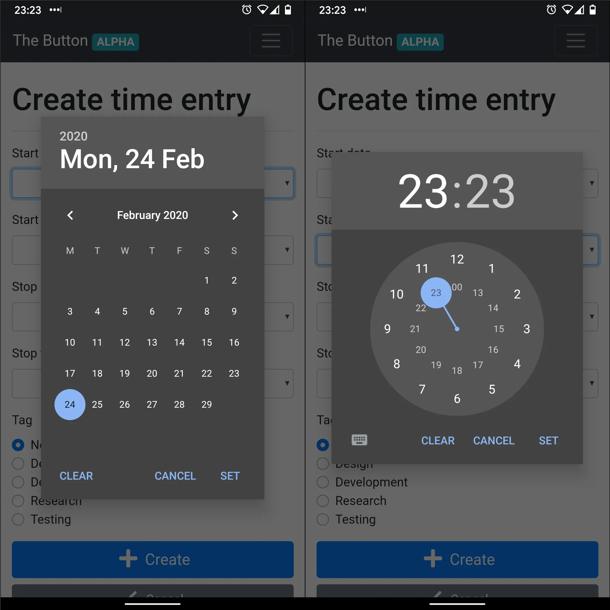
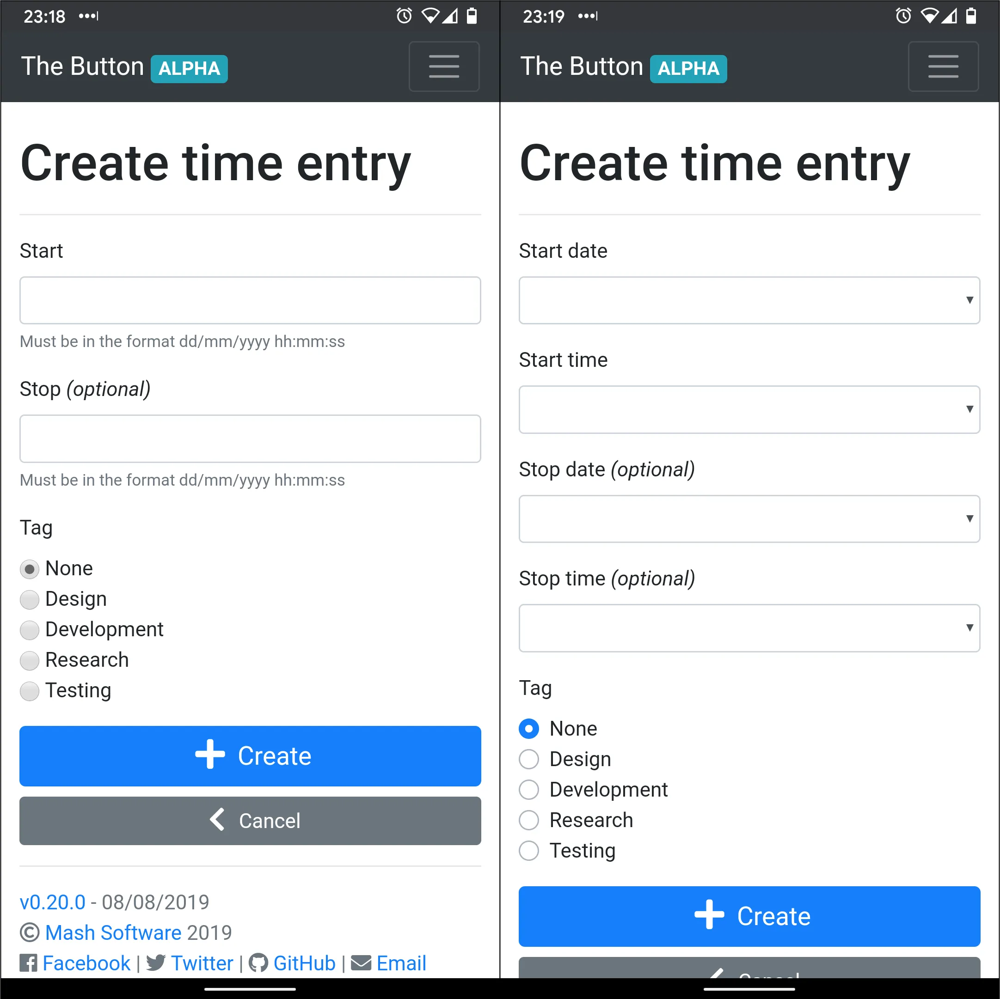
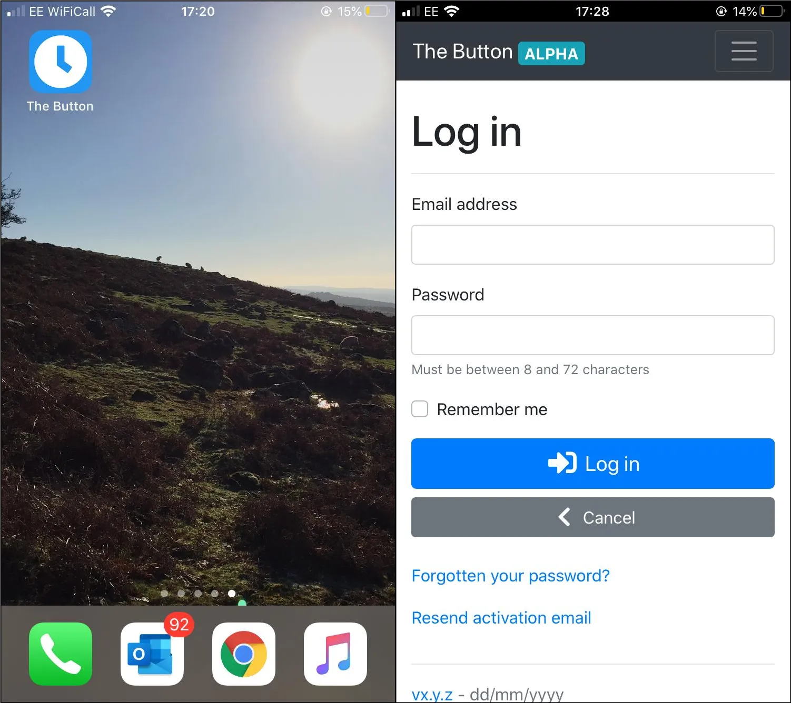
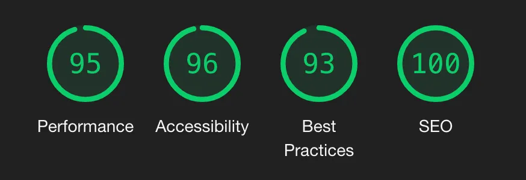

---
date:
  created: 2020-02-25
authors:
  - mash
categories:
  - Software Development
  - Mash Software
title: Mash Time Tracker
description: Native controls, app icons & performance
tags:
  - Accessibility
  - Bootstrap
  - Performance
  - Security
  - UX
  - WTForms
---

# Mash Time Tracker: Native controls, app icons & performance

It's been a long time since the [previous release](mash-time-tracker-tags.md) of [Mash Time Tracker](https://time-tracker.mashsoftware.com/) in August 2019; life, work and free time have been the enemies of side project progress! I've had a number of features "parked" for a while, stuck behind other parts I had started working on and not finished. I've decided to unblock them to get incremental improvements out sooner rather than wait for the bigger features to be ready. I'll try and focus on smaller and more frequent releases in future.

<!-- more -->

So here's the latest small, but hopefully still significant [release v0.21.0](https://github.com/MashSoftware/the-button/releases/tag/v0.21.0). This one is all about making the web app look and feel even more like a native app installed on your smartphone or desktop OS, which should also bring about some big usability improvements.

## Device native controls

Date and time entry controls have been split out, from a single text input to two inputs using their specific HTML5 input types. This means that on a regular desktop browser you will see that browsers own specific date and time controls. On an Android or iOS device you will see the OS's native controls for selecting dates and times that are familiar to people using those platforms, and much easier to use!

{ width="600" }

## Custom form controls

In addition to the native controls, other form controls such as radio buttons and check boxes now use [custom Bootstrap form styles](https://getbootstrap.com/docs/4.4/components/forms/#custom-forms). There are two main reasons for switching. Firstly, consistency; all browsers and OS's will now display these controls in the same way. Secondly, aesthetics; their look and feel is more in keeping with the rest of the visual design.

{ width="600" }

## App icons

Thanks to Joe Honywill for this feature request. This will help people to access [Mash Time Tracker](https://time-tracker.mashsoftware.com/) from the home screen of their mobile device. Along with using native controls, this change makes [Mash Time Tracker](https://time-tracker.mashsoftware.com/) feel even more like a natively installed app on a mobile device. Correctly sized [icons are available for all platforms](https://realfavicongenerator.net/favicon_checker?protocol=https&site=mash-the-button.herokuapp.com) including iOS, Android, Windows 8/10, MacOS and classic desktop browsers.

{ width="600" }

## Lighthouse

I've [previously blogged](mash-time-tracker.md) about using [Google PageSpeed Insights](https://developers.google.com/speed/pagespeed/insights/) to help optimise the performance of the service, but because [Mash Time Tracker](https://time-tracker.mashsoftware.com/) requires an account PageSpeed isn't able to analyse pages behind authentication. That's where [Lighthouse](https://developers.google.com/web/tools/lighthouse/) comes in; using the tool baked in to Chrome I've been able to delve deeper into the more complex time entry pages and make further performance, accessibility, best practice and SEO improvements.

{ width="600" }

## Account page

Redesigned account information page taking direct inspiration from the [GOV.UK Summary List component](https://design-system.service.gov.uk/components/summary-list/). Making better use of horizontal screen space when it's available, whilst keeping the mobile view sensible with action links in-line with their content. More readable, less clutter, just better.

## Other bits and pieces

- All textual content pages, such as the help page, are now 2/3 width on larger devices, for more readable line lengths.
- Form related pages are 1/2 width on larger devices.
- All required frameworks and libraries have been updated to the latest versions, making sure to keep up with critical security patches.
- Some behind-the-scenes backend work to prepare for an upcoming feature.

More details to follow in the next release blog!

---

[:fontawesome-brands-bluesky: Share on Bluesky](https://bsky.app/intent/compose?){ .md-button .md-button--primary }

[:fontawesome-brands-x-twitter: Share on Twitter](https://twitter.com/intent/tweet?){ .md-button .md-button--primary }
