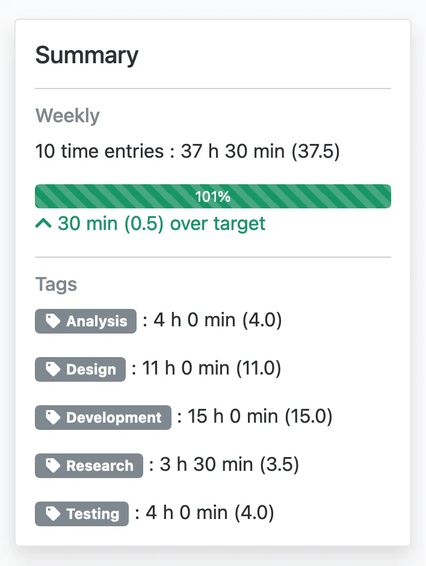
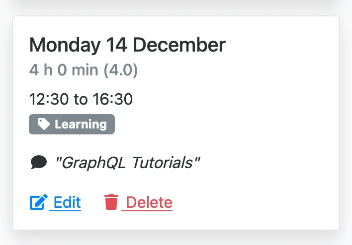
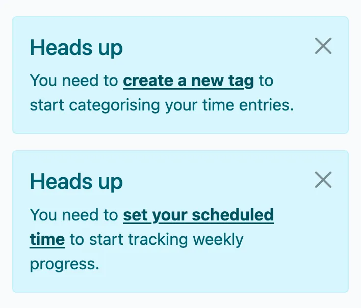
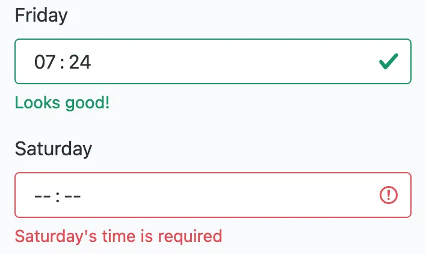

---
date:
  created: 2020-12-31
authors:
  - mash
categories:
  - Software Development
  - Mash Software
description: Weekly summaries, comments & UI upgrade
tags:
  - Bootstrap
  - CI/CD
  - Python
  - Security
  - UX
  - WTForms
---

# Mash Time Tracker:   Weekly summaries, comments & UI upgrade

2020 was a difficult year for many people in previously unimaginable ways. 2021 doesn't immediately appear to be an improvement for most people, although there is hope on the horizon, and maybe by this time next year we might be experiencing at least a moderate improvement.

<!-- more -->

If you have been lucky enough to remain in your job and find yourself working from home, this may still not be a welcome situation for you. Balancing the demands of home, family and working life all under the same roof is hard. When I started [Mash Time Tracker](https://time-tracker.mashsoftware.com/) it was all about making time management easier, quicker and simpler and as we start a new year I still want to do that.

## Weekly summary

{ width="600" }

I've refined the weekly time progress bar into a new summary component. You can see the total number of entries and time recorded in a given week, as before. But now you also get the total time recorded against each tag used as well. So if you work on multiple projects or activities you can easily see how you've allocated your time. If you also have to enter your time into a corporate time management system, this further helps to simplify the process as you can very quickly see your overall total weekly time and allocation to specific activities in one single and simple place.

## Comments

{ width="600" }

Forgotten what you were doing last Monday? Tag not jogging your memory? Me too! Now you can add a short comment to document more of what you were doing.

## New user experience

The experience a first time user has of the service after signing up was not brilliant, without sufficient explanation of what they can do next other than "start now". As the number of features in the service grows it's important that both new and existing users can easily discover and use them, especially if they don't read these blogs.

Now users will be prompted to create tags and set their scheduled time if they haven't done so already, or have just created their account. These prompts explain what the feature is for and contain links directly to the appropriate forms to make it as understandable and easy as possible.

{ width="600" }

## UI improvements

The headline change here is the upgrade from Bootstrap 4.5.x to Bootstrap v5 Beta 1. Since this beta release of Bootstrap marks the first stable one without breaking changes or new features to come I wanted to get ahead and upgrade. There are a lot of improvements to note, but I've also used it as an opportunity to re-assess some of my earlier design choices and make sure they still make sense in the new version. These include things like spacing, alert contexts, use of colour for visual feedback, button sizing and layout, responsive design considerations and form validation feedback.

{ width="600" }

Bootstrap 5 also has the added bonus of no longer requiring the use of JQuery. Removing JQuery has reduced an average page load down from 546 kB to 464 kB, a 15% reduction. This makes an already very small page size even faster to load, especially on mobile devices and networks. Speed and simplicity are the primary goals of [Mash Time Tracker](https://time-tracker.mashsoftware.com/) and this change is a welcomed contribution to both.

## CI/CD pipeline

I've also done some engineering housekeeping to address technical debt and follow best practices and standards. There was some repeated code that is now a common utility with unit tests to cover all scenarios, ensuring it behaves as expected.

I've recently switched from using [Travis](https://travis-ci.org/) to [GitHub Actions](https://github.com/features/actions) for my CI/CD pipelines and I really like it. Travis has served me well for years, but waiting 20+ minutes for a build to start was no longer acceptable when GitHub offers a comprehensive, and fast alternative. To be completely honest, I have been remiss in not writing any meaningful unit tests until now and I will gradually address that with each subsequent release.

My pipeline now checks the app's dependencies are up to date and that there are no known security vulnerabilities associated with any of them. It then performs static code analysis ("linting") to ensure that it conforms with Python language style guides. Finally, it run's the unit test suite. This is matrix tested against each currently supported version of Python, should I, or anyone else want to deploy it on a different stack.

## Next up...

Looking back over the wishlists from the last few blogs:

- [x] Tagging time entries
- [ ] Tag time targets
- [ ] Ongoing time balance
- [ ] Daily time delta against schedule
- [x] Weekly summary of tagged time
- [ ] Change entry limit to time period instead of quantity
- [x] Comment on time entries

I'm going to continue working on the daily time deltas, alongside some more background code improvements and a more comprehensive test suite.

## Thanks

Thanks for using [Mash Time Tracker](https://time-tracker.mashsoftware.com/) in 2020, please send any feedback and raise any [bug reports or feature requests](https://github.com/MashSoftware/time-tracker/issues/new/choose) you have, it really is appreciated. :grinning:

---

[:fontawesome-brands-bluesky: Share on Bluesky](https://bsky.app/intent/compose?text={{ page.title }} by @mash85.bsky.social {{ page.canonical_url }} %23{{tag}} ){ .md-button .md-button--primary }

[:fontawesome-brands-x-twitter: Share on Twitter](https://twitter.com/intent/tweet?text={{ page.title }}&url={{ page.canonical_url }}&hashtags={{tag}},&via=MattShaw85){ .md-button .md-button--primary }
