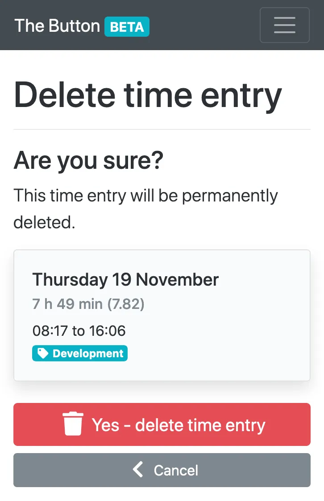

---
date:
  created: 2020-11-28
authors:
  - mash
categories:
  - Software Development
  - Mash Software
description: Weekly view, time schedules & begining beta
tags:
  - Accessibility
  - Bootstrap
  - UX
  - WTForms
---

# Mash Time Tracker: Weekly view, time schedules & begining beta

One of my favourite stickers on my laptop is Simon Wilson's [_"Always be in beta"_](https://www.ermlikeyeah.com/gov-patches/) design. It serves as a reminder that, generally speaking, services are never _finished_ and that continual gradual improvement is the best approach to take. I'm sure this service will be no different.

<!-- more -->

## It's beta time

I originally started [Mash Time Tracker](https://time-tracker.mashsoftware.com/) as a side project to reduce some of the frustration of using a corporate time recording system from one of the big enterprise vendors. Once I'd got to a certain stage I thought; _"this is quite useful, maybe other people would find it useful too?"_. So [I released it](mash-time-tracker.md) as an open public [alpha](https://en.wikipedia.org/wiki/Software_release_life_cycle#Alpha) and have blogged about the iterative releases since then [here](mash-time-tracker-tags.md) and [here](mash-time-tracker-native.md). That was 14 releases and 18 months ago and, to be honest, I've not devoted all that much time to it in the last 9 months. Who knew a global pandemic and adjusting to a new work/family life balance would be so counter-productive to personal side projects?

That said, I feel that after 18 months of myself and a small number of other people regularly using it, I'm pretty confident the core MVP-level features are solving basic user needs. Now it's all about refining those, then adding additional features to meet more complex user needs, without undermining the simplicity and speed of the core features. Starting with...

## Weekly view

This is now the default view of your time entries, instead of one _long_ paginated list. Time entries are collated by calendar week and displayed in descending date order. The previous pagination controls have been replaced by previous, current and next week navigation, with the current week being the default. This solves the problem of multiple entries from the same day being split across two pages, which resulted in incorrect daily totals on each page.

Moreover, I believe this better fits with peoples mental models of their working time. People tend to think in terms of weeks of activity, not a continuum of individual days. I've added a progress indicator to visually indicate to the user whether they have recorded more or less time this week than they were scheduled to, and if so how much (more on that below).

This is particularly useful if you also have to record your time elsewhere and want to duplicate only the minimum of effort by just entering a single weekly total, or claiming a weekly time credit/debit.

{ width="600" }

## New time card design

I thought the previous time card design became too cluttered and didn't make it clear what the users expected interactions were. This iteration is not radically different, containing the same information, but laid out more clearly. Instead, it now ephasises to the user what actions they can take with each time entry, hopefully making it easier to understand.

As a result of this, multiple time entries for the same day are no longer grouped together, as I felt the cluster of interactions within a single visual container was too busy. Now, one card relates to one time entry and what you can do with _that_ entry alone. User feedback is, as always, very much welcome and encouraged as this is, along with the weekly view, the biggest visual change since the alpha release 18 months ago.

{ width="600" }

## Time schedules

In order to know how much progress has been made through a week, the app needs to know how much time you intend to work on which days. This is usually people's regular contracted working hours, but could be used for anything where you anticipate an amount of time spent each week and want to track progress against that. You can find the option to set your scheduled time in your account settings.

{ width="600" }

## More tags

You can now create up to eight unique tags, increased from five, to categorise your time entries with, so you can track all the things.

{ width="600" }

## Start a tag now

Now you have all of those tags at your disposal you can start a new time entry with one of them immediately using the drop down menu of the main _"Start now"_ button. No more having to edit a time entry later to tag it with what you were doing if you already knew that before you started.

{ width="600" }

## No more modals

Inspired by [this tweet](https://twitter.com/adambsilver/status/1290266510334681088) (and other excellent work by Adam Silver and Amy Hupe), I've removed all modal dialogs used as a safety mechanism before deleting something. Instead these have been replaced with new pages, which dont break users expectation of how the back button works and actually allow more space to make the content a lot clearer.

{ width="600" }

## And the rest

Those are the headline features in this release, but I've been tweaking and tuning a few other quality-of-life related things:

- Increased entry limit from 80 to 120, after which the oldest entry is deleted upon creating a new one. Should be enough to allow people to record two entries a day, five days a week, for three months.
- [Open Graph Protocol](https://opengraphprotocol.org/) metadata tags to enable better link sharing on social media.
- [ARIA](https://www.w3.org/WAI/PF/aria/introduction) attributes added to help text within forms, to improve accessibility and assistive technology user experience.
- Improved email address validation on sign up, log in, password reset, account activation and account update. Now provides more granular error messages if an input email address is invalid. Also checks the deliverability of the email address by resolving the domain name.
- Consistent actions, headings and confirmation messages.
- Increased rate limit to allow for more user requests per second before hitting an error page.
- Fixed bug in validating timestamps stored as UTC and displayed in the users selected timezone when editing an existing time entry.

## Next up...

- Daily time credit / debit against scheduled working hours.
- Weekly summary of time spent on each tag, to help with recording allocation of time to projects.
- Remove numerical entry limit in favour of a time based one which automatically removes entries over a certain age. As the number of users increases this will be a better approach to keeping the storage requirements of the app down.
- Comments on time entries? Let me know!

---

[:fontawesome-brands-bluesky: Share on Bluesky](https://bsky.app/intent/compose?){ .md-button .md-button--primary }

[:fontawesome-brands-x-twitter: Share on Twitter](https://twitter.com/intent/tweet?){ .md-button .md-button--primary }
