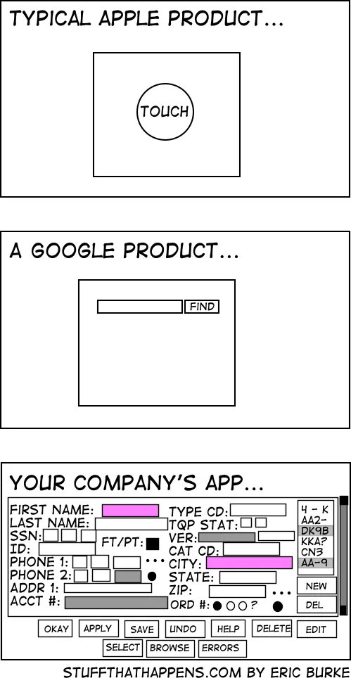
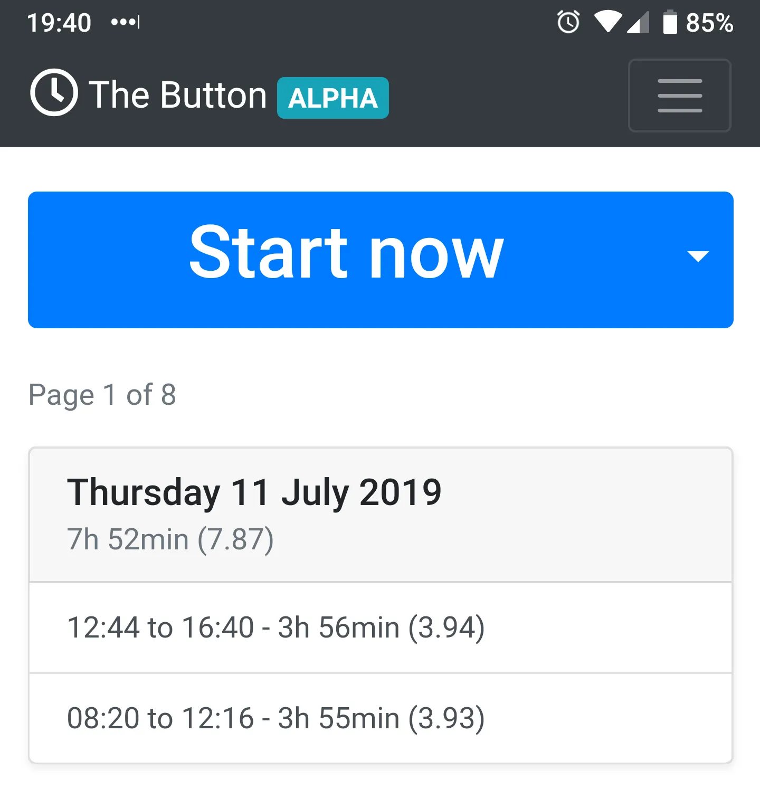

---
date:
  created: 2019-07-12
authors:
  - mash
categories:
  - Software Development
  - Mash Software
description: Time recording made simple.
tags:
  - Bootstrap
  - Flask
  - Performance
  - PostgreSQL
  - Python
  - Redis
  - Security
  - SQLAlchemy
  - UX
  - WTForms
---

# Mash Time Tracker

One of my first jobs in software development after leaving university was to rewrite a corporate time management system. So it seems ironic that after 12 years of experience I find myself coming right back to where I started.

<!-- more -->

I definitely committed some software sins on that project. Especially by pushing complexity and required knowledge on to the user, forcing them to figure it out for themselves instead of [doing the hard work to make it simple](https://www.gov.uk/guidance/government-design-principles#do-the-hard-work-to-make-it-simple).

In the years since I've always had the kind of job that requires me to keep track of my time for flexible working hours. I've had to live with my previous mistakes, and have also had _far_ worse user experiences in systems from the usual big enterprise vendors.

When you walk through an office and see the same spreadsheet on so many people's screens, because they prefer to use _that_ over the system they're otherwise forced to use, you know something has gone wrong. It's that observation, and the desire to find a simple solution to the problem that has led me to create "[Mash Time Tracker](https://time-tracker.mashsoftware.com/)".

## Simple

A lot of corporate and internal facing interfaces end up like the third example above. People believe that the complexities of their particular organisation are irreducible and can't be distilled into something simple.

It's also regrettable that we put so much time and effort into making user centred products and services for external customers, then totally forget that internal users are customers too. Back-office administrative systems aren't as sexy, but people use them all day every day and deserve better.

Simplicity does not mean basic. Case in point; the single search field in Google Maps which takes free-format unstructured terms and manages to turn that into a structured address for (nearly) anywhere in the world. The simplicity of the solution hides a world of complexity from the user but does not mean the solution itself is basic.

!!! quote "Twelve Principles of Agile Software"
    Simplicity--the art of maximizing the amount of work not done--is essential.

    <https://agilemanifesto.org/principles.html>

The most simple way I could think of to record time spent doing something was a stopwatch. Press a button to start it, press it again to stop, see how long that was. It does one thing and it does it well. As that's all I want the app to do, that's all I've focused on for the MVP ([alpha](https://en.wikipedia.org/wiki/Software_release_life_cycle#Alpha)) release, to refine the core functionality.

## Quick

I've focused on making the app and the UI as small and fast possible. All responses are [gzipped](https://en.wikipedia.org/wiki/Gzip), to minimise data transfer, which is particularly important on mobile networks, but benefits everyone. All assets come from large CDNs, so there's a good chance you already have a copy in your browser cache. If you don't, then they're all [minified](<https://en.wikipedia.org/wiki/Minification_(programming)>) so take up as little space as possible, helping to keep page load time down.

I've implemented reasonable [rate limits](https://en.wikipedia.org/wiki/Rate_limiting), to help protect the application from abuse and maintain a good service for all users. This is backed by [Redis](https://redis.io/), a super-fast in-memory cache. You should never notice it doing its job, but I will continue to monitor this and adjust if needed.

The result of this careful effort is a [Google PageSpeed](https://developers.google.com/speed/docs/insights/v5/about) score of [100% on desktop and 99% on mobile](https://pagespeed.web.dev/analysis/https-time-tracker-mashsoftware-com/82ugui0wcf)!

## Secure

But what good is speed at the expense of security?

I'm using an extension called [Talisman](https://github.com/GoogleCloudPlatform/flask-talisman) to handle setting HTTP headers. This can help protect against a few common web application security issues, including:

- Force all connects to HTTPS.
- Enable HTTP Strict Transport Security (HSTS) to protect against [session hijacking](https://en.wikipedia.org/wiki/Session_hijacking).
- A strict Content Security Policy (CSP) with only specific resource types allowed. This prevents [cross-site scripting](https://en.wikipedia.org/wiki/Cross-site_scripting) (XSS), [clickjacking](https://en.wikipedia.org/wiki/Clickjacking) and other [code injection](https://en.wikipedia.org/wiki/Code_injection) attacks.

This has gained the service an [A+ rating](https://securityheaders.com/?q=https%3A%2F%2Ftime-tracker.mashsoftware.com%2F&followRedirects=on) on [securityheaders.com](https://securityheaders.com/), but there's far more to web security than headers alone:

- Protected against [SQL injection](https://en.wikipedia.org/wiki/SQL_injection) attacks thanks to [SQLAlchemy's](https://www.sqlalchemy.org/) [object-relational mapping](https://en.wikipedia.org/wiki/Object%E2%80%93relational_mapping) (ORM) generating parameterised SQL.
- All forms are protected against [cross-site request forgery](https://en.wikipedia.org/wiki/Cross-site_request_forgery) (CSRF) attacks by using CSRF tokens in [WTForms](https://wtforms.readthedocs.io/en/stable/).
- All external resources use [subresource integrity](https://en.wikipedia.org/wiki/Subresource_Integrity) (SRI) checks, ensuring assets have not been compromised.
- User passwords are encrypted using [bcrypt](https://en.wikipedia.org/wiki/Bcrypt), a slow [key derivation function](https://en.wikipedia.org/wiki/Key_derivation_function). It is resistant to [rainbow table](https://en.wikipedia.org/wiki/Rainbow_table), [dictionary attacks](https://en.wikipedia.org/wiki/Dictionary_attack) and [brute force attacks](https://en.wikipedia.org/wiki/Brute-force_attack).
- User account emails contain a unique, time-limited URL. This uses [JSON Web Tokens](https://jwt.io/) (JWT) that are digitally signed using HMAC with SHA-256. Activation and confirmation tokens expire in one hour, and password reset tokens expire in ten minutes.

## Web first

_"You should create an app for that!"_ said my wife when I was telling her about this idea. It's a fair assumption in today's smartphone-driven digital world, but not one I subscribe to. For something as lightweight as this that doesn't need an OS native app, it's a big overhead for a developer. It's more complex to write and slower to deploy/release. The user has to find the app on a marketplace, install it and take up valuable storage space otherwise used for photos of their kids/cats/lunch.

I've taken a mobile-first approach to the design of [Mash Time Tracker](https://time-tracker.mashsoftware.com/), so it looks great and works well on all sizes of device. But more importantly, I've adopted a web-first approach that treats the browser as a first-class citizen and not a fallback option. That's _any_ browser on pretty much _any_ device by the way, not just Android or iOS.

The web is open, democratic and free (as in speech, not beer), in a way that app stores tend not to be.

## Open

I store the least amount of data possible, not only to limit my own storage needs and liabilities, but because it's the right thing to do. It may help to know the users first and last name for personalisation, but the app does not _need_ it, so I don't ask. The only personally identifiable information held is an email address. All data is stored in the EU too, to enjoy better data privacy and protection legislation.

The email address the user provides is only used for transactional emails initiated by the user, and never for marketing purposes, so I believe this is GDPR compliant. The user creates a legitimate interest in receiving transactional emails when they create an account. This is my interpretation of GDPR around transactional emails without explicit consent, but I'd be happy to take some advice on this from an expert!

If you decide you don't like the service or don't want your data held in it anymore, that's fine, you are in full control of your data. You can delete your account at any time, which includes all your time entries, in one action. No soft-deletes or archiving here, deleted means deleted.

You don't have to take my word for it either, you can see the full source code for the application on [GitHub](https://github.com/MashSoftware/time-tracker). If you don't want the technical details then there's a human-readable [changelog](https://github.com/MashSoftware/time-tracker/blob/main/CHANGELOG.md) with all notable changes in every release. It's licenced under the [MIT licence](https://github.com/MashSoftware/time-tracker/blob/main/LICENSE) too, so you can run your own instance and make improvements. [Issues](https://github.com/MashSoftware/time-tracker/issues) and [pull requests](https://github.com/MashSoftware/time-tracker/pulls) are always very much appreciated!

## Alpha

{ width="600" }

Today I have released the first public alpha version of [Mash Time Tracker](https://time-tracker.mashsoftware.com/). As with all pre-release software, this is one for [early adopters](https://en.wikipedia.org/wiki/Early_adopter) who want to help test the service in the real world and shape the direction of its development. As such, your feedback on the service is incredibly important, to help me understand what works well, what doesn't and where to focus my effort. Whilst I am confident there aren't any major bugs or issues, these things come out in the wash, so please be aware.

These are the features currently in the service:

### Accounts

Sign up for an account. Confirm email address. Log in and out. Change email address and password. Delete account.

### Time entries

Create an automatic time entry. Edit and delete time entries. Create a manual time entry. Page through previous entries (10 per page). Create up to 80 entries, after which the oldest entry is deleted when a new one is created.

## Next steps

I'm going to continue iterating on this project to further refine it. I'll also be adding more features in response to user needs and feedback over time. But, I'm very aware that [feature creep](https://en.wikipedia.org/wiki/Feature_creep) can start to undermine the original simplicity of a product. Some features that I am confident I can introduce without losing too much of that simplicity are:

- **Tagging** — maintain a set of tags to organise and categorise your time entries.
- **Tag targets** — Associate an amount of time with a particular tag and track progress towards this target.

Some problems that are going to need more thought to simplify, but are worth doing:

- **Time balance** — for people who work flexible hours and have a credit/debit system and want to track their current balance.

## Thanks

Please sign up for [Mash Time Tracker](https://time-tracker.mashsoftware.com/), try using it in your day-to-day life and raise any bug reports or feature requests you have.

Thanks for reading!

---

[:fontawesome-brands-bluesky: Share on Bluesky](https://bsky.app/intent/compose?text={{ page.title | urlencode }} by @mash85.bsky.social {{ page.canonical_url }} %23{{tag}} ){ .md-button .md-button--primary }

[:fontawesome-brands-x-twitter: Share on Twitter](https://twitter.com/intent/tweet?text={{ page.title | urlencode }}&url={{ page.canonical_url }}&hashtags={{tag}},&via=MattShaw85){ .md-button .md-button--primary }
