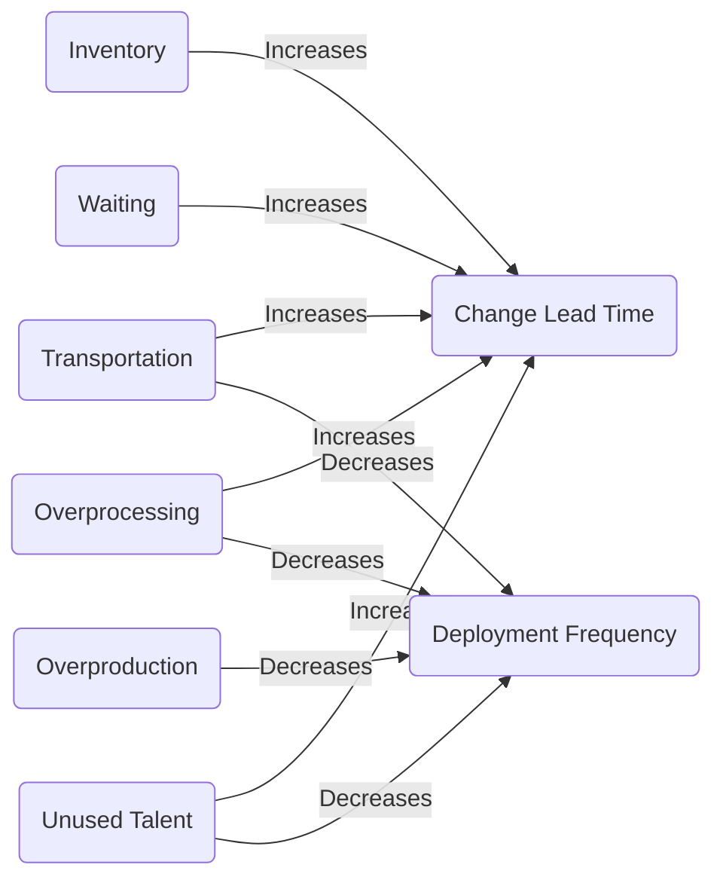
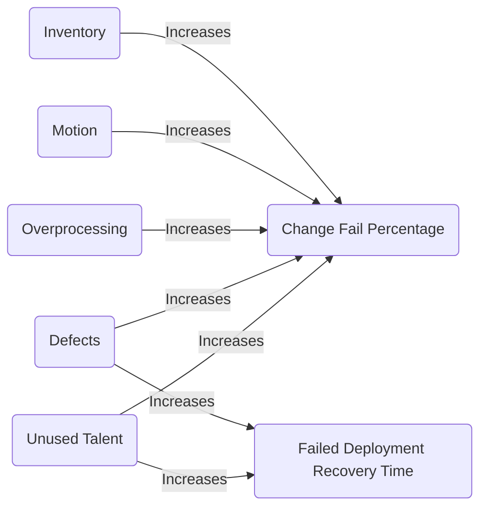
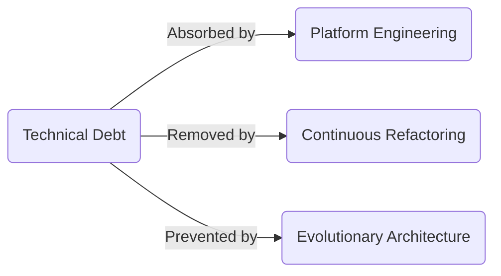

# Lean Thinking in Modern Software Delivery

Eliminating waste, unevenness, and overburden to build sustainable high-performance technology organisations.

<!-- more -->

> This white paper is a restructured and expanded compilation of three other posts on my blog:
>
> - [Muda: The Eight Wastes of Modern Software Delivery](lean-muda.md)
> - [Mura: The Source of Uneven Flow](lean-mura.md)
> - [Muri: The Root Cause of Overburden](lean-muri.md)

## Executive summary

Software delivery frequently underperforms not due to a lack of talent, but because teams operate inside systems constrained by three **Lean** forces: waste, uneven flow and overburden. Uneven flow and unreasonable load are the root causes; visible waste is the predictable outcome. Together, these forces steadily erode the return on technology investment.

Drawing on empirical evidence from the **DORA** programme, this white paper explains how elite-performing organisations differentiate themselves. They do not rely on rigid frameworks or "Agile theatre"; instead, they systematically remove the frictions that delay value and destabilise delivery.

The analysis shows how overloaded people and systems create unpredictable flow, which in turn generates delays, rework, defects and burnout. Treating waste without addressing flow and load only entrenches the problem.

The paper presents a practical, sociotechnical approach to recovery. By combining **Team Topologies**, **Platform Engineering** and pull-based working, organisations can reduce cognitive load, stabilise flow and create a sustainable pace of delivery.

This is a leadership guide to move beyond symptom management, offering a clear blueprint to redesign organisations for measurable, long-term performance.

---

## Introduction

In manufacturing, **Lean** thinking revolutionised how products were built by relentlessly eliminating waste. Software is _not_ manufacturing, and the "software factory" analogy is deeply flawed. Yet, the core **Lean** principle of respecting resources and optimising flow remains the foundation of modern high-performance software delivery.

To apply this to software, we must consider the three systemic forces identified in the Toyota Production System by engineer Taiichi Ohno:

- _Muda_ (無駄), meaning "waste", "futility" or "uselessness", is any activity that consumes resources but creates no value.
- _Mura_ (斑), meaning "unevenness" or "irregularity" is the inconsistency in how work flows.
- _Muri_ (無理), meaning "overburden" or "unreasonable load", is a pressure that exceeds sustainable limits.

Ohno's core insight was that the visible symptoms of waste are fundamentally caused by unevenness of flow and unreasonable load, which must be eliminated first to create a stable process.

Decades later, research from the _Accelerate_ book and the **DORA** programme has validated these principles not just as philosophy, but as the empirical baseline for high-performing teams. I have seen first-hand how even the most well-intentioned teams can be affected by these forces.

This is a practical guide to diagnosing and resolving these issues. We will begin by identifying the symptoms (Waste), trace them to the flow problems (Unevenness), and finally address the root cause (Overburden) using a sociotechnical approach.

---

## Muda: The eight wastes

Modern practitioners have adapted the original seven wastes identified by Ohno, adding a critical eighth form: [unused talent](#unused-talent). In software development, waste often hides in queues, backlogs, meetings, or handoffs.

### Transportation

In manufacturing, transportation waste is the unnecessary movement of materials - moving parts without improving them. In software, it's the same pattern made invisible: unnecessary handoffs between people, tools, or environments.

Every transfer adds friction and risk. Knowledge gets diluted, priorities drift, and work waits for permission to move. The cost isn't just time - it's lost clarity, context, and momentum. Reducing transportation means shortening the path from idea to running code in production and giving teams direct ownership of outcomes.

### Inventory

In manufacturing, inventory waste means stock that's been built but isn't delivering value. In software, that inventory lives as unfinished code, unmerged branches, bloated backlogs that are rarely pruned, and half-validated features.

Every line of dormant code represents work that's not improving services. It clogs flow, hides [defects](#defects), and accumulates merge conflicts, stale dependencies, and forgotten context. **Lean** flow depends on fast feedback. When inventory piles up, feedback slows, and value creation stops. The focus must shift from starting work to finishing work.

### Motion

Motion waste is the unnecessary movement of people or tools. In software, it shows up as manual setup steps, repetitive configuration, inconsistent environments, or scattered information.

Every manual click or repeated setup is friction that interrupts focus. Developers spend time wrestling with tools instead of solving problems. Reducing motion means building a smooth, predictable developer experience - one where environments, builds, and feedback are automatic, consistent, and close at hand.

### Waiting

In manufacturing, idle machines burn money. In software, idle people burn opportunity. Waiting waste is the silent cost of slow builds, blocked reviews, overloaded dependencies, or delayed feedback.

Every delay in the feedback loop weakens flow and motivation. Engineers lose context, teams lose pace, and users wait longer for improvements. Reducing waiting means collapsing those loops - making feedback continuous, not calendar-driven - so progress never depends on someone else's availability.

### Overproduction

Overproduction is building more than what's needed - features without validation, designs without user input, or automation without purpose. Building more code also means _maintaining_ more code.

It's seductive because it looks like progress. Teams deliver features, fill backlogs, and complete roadmaps - but if it doesn't meet a user need or improve service quality, it's waste disguised as delivery. Reducing overproduction means focusing relentlessly on outcomes, not output. The measure of success is user value, not feature count.

### Overprocessing

Overprocessing is doing more work than necessary for the same result. In software, it's overengineering, unnecessary abstraction, or process overhead added "just in case".

Complexity accumulates quietly - every extra layer, meeting, or document increases cognitive load and slows adaptation. The result is a system that's heavy where it should be light. Reducing overprocessing means matching effort to value - choosing simplicity, clarity, and sufficiency over theoretical perfection.

### Defects

Defects are the most visible waste - bugs, outages, regressions, or rework. But every defect is a symptom of a deeper process failure - a flaw in testing, a gap in understanding, or a rushed review.

The later an error surfaces, the more expensive it becomes. Each missed test, unchecked assumption, or rushed review compounds until failure becomes inevitable. Reducing defects means building quality in - making testing, feedback, and improvement continuous parts of delivery rather than after-the-fact correction.

### Unused talent

Often considered the most damaging waste of all, particularly in knowledge work: failing to use the creativity and insight of the people closest to the work.

When teams are reduced to task-takers, innovation dies. The best engineers become disengaged, and the organisation loses its capacity to learn, adapt, and improve. Reducing this waste means treating developers as designers of systems - trusted to experiment, decide, and continuously shape how value flows to users.

### Software delivery performance

The eight wastes are empirically linked to degraded software delivery performance. Data from the [Accelerate State of DevOps Report 2024](https://dora.dev/research/2024/dora-report/2024-dora-accelerate-state-of-devops-report.pdf) allows us to quantify exactly how these wastes impact the four key metrics of high performance.

#### The impact on throughput

Wastes that introduce friction devastate velocity:

- **Change Lead Time**: Queues caused by high [inventory](#inventory) ([Little's Law](https://en.wikipedia.org/wiki/Little%27s_law)) and the "hurry up and wait" cycles of [transportation](#transportation) and [waiting](#waiting) are the primary drivers of slow delivery. Low performers take between one and six months to go from commit to production. Elite performers, who have eliminated these wastes to achieve continuous flow, take less than one day, achieving a **127 times faster lead time**[^1].
- **Deployment Frequency**: [overprocessing](#overprocessing) and [transportation](#transportation) act as brakes on throughput. Low performers only deploy to production between once a month, and once every six months. In contrast, Elite performers achieve an on-demand Deployment Frequency, deploying multiple times per day, **182 times more deployments per year**[^1].

#### The impact on stability

Wastes that obscure feedback or increase complexity destroy system stability:

- **Change Fail Percentage**: High [inventory](#inventory) and [overprocessing](#overprocessing) are correlated with higher failure rates. Low performers suffer a failure rate of ~40%, whereas Elite performers maintain a rate of ~5%. Simply put, holding [inventory](#inventory) and relying on manual [motion](#motion) makes you **8 times more likely to fail**[^1].
- **Failed Deployment Recovery Time**: When [defects](#defects) do occur, the ability to recover is defined by how much waste is in the system. Low performers take between one week and one month to recover from a failed deployment, while Elite performers recover in less than one hour. This remarkable **2,293 times faster recovery time**[^1] highlights that waste doesn't just cause failures; it prevents recovery.

#### The multiplier

[Unused talent](#unused-talent) acts as a dampener on all four metrics simultaneously. A [generative organisational culture](https://dora.dev/capabilities/generative-organizational-culture/), as defined by sociologist Dr. Ron Westrum, is a strong predictor of high performance. Organisations that display pathological cultures and waste talent through low autonomy or high burnout are strongly correlated with low performance in _all four_ key metrics.

### From symptoms to systems

The eight wastes aren't just a checklist: they're a mindset. They challenge us to constantly ask: _"Is this activity adding value, or just keeping us busy?"_

But waste is only a symptom. The real question is: why does waste appear in the first place?

---

## Mura: The source of uneven flow

_Mura_ manifests as periods of low activity followed by frantic catch-up, the "hurry up and wait" cycle, rendering delivery unpredictable and unsustainable. This section examines in depth how to identify uneven flow, and how modern software delivery practices work together to reduce inconsistency and create predictability.

### The detection kit

The principles of **Lean** have been empirically validated for software delivery by the extensive research in the _Accelerate_ book and the ongoing **DORA** programme. This work gave us the four key metrics that are now the industry standard for predicting team performance.

The **DORA** metrics are not performance scorecards; they are flow indicators. The goal isn't simply to achieve "good" numbers. The goal is to reduce variance.

#### Change lead time

A high average lead time is a problem, but a high variance (or standard deviation) is a warning signal.

If your team delivers one feature in two days, but the next one takes forty, your system isn't just slow, it's chaotic. This variance makes forecasting impossible. It's the single best indicator that your process is unpredictable and riddled with hidden waste (such as [waiting](#waiting) for code reviews or environments, [transportation](#transportation) as work bounces between functions, or not using the talent closest to the work). A smooth flowing system has a tight, predictable lead time.

#### Deployment frequency

An inconsistent deployment cadence is a clear sign of batching and queues.

Deploying twenty changes on a Tuesday afternoon and then nothing for four days isn't high frequency; it's batched and irregular delivery. It's a sign of an uneven system that fails to decompose work effectively, then waits for a "Release Day", creating a massive [inventory](#inventory) of undeployed code. A smooth flowing system has a consistent, rhythmic deployment cadence - or even better a fully automated deployment on-demand.

#### Change fail percentage

A spiky Change Fail Percentage is a lagging consequence of rushed work.

This often indicates a failure to engage with stakeholders, producing poorly refined work, without a clear scope and inflicting a deadline-driven ["crunch"](https://en.wikipedia.org/wiki/Crunch_(video_games)) cycle. The team was forced to rush to meet an arbitrary sprint boundary or release date. They cut corners, skipped tests, and force pushed their way to "done". The resulting spike in [defects](#defects) is the unavoidable effect of that unevenness. This also indicates that builds lack determinism, relying on inconsistent or manual steps instead of a fully automated process.

### The solutions

Unevenness is created by push-based systems, where work is started regardless of downstream capacity, which guarantees [overproduction](#overproduction) and [transportation](#transportation) waste. If we push unrefined work onto teams, or push untested code into a release branch, or push a sprint's-worth of "done" work onto the testers on the final day, we're actively creating instability.

The solution is a fundamental cultural and technical shift to pull-based systems, where work is started only when downstream capacity is available.

#### The management system

**Kanban** (not just a "JIRA board") is a management system for diagnosing and stabilising flow.

The key to **Kanban** is the Work in Progress (WIP) limit. WIP limits are not intended as a productivity cap; they are a control that improves flow and throughput by reducing context-switching and queues. It is a simple rule that forces the team to stop starting work and start finishing it.

WIP limits relentlessly expose hidden bottlenecks, making the [waiting](#waiting), and the unevenness painfully visible. By forcing the team to pull new work only when capacity is available, WIP limits naturally smooth the flow.

This is not philosophy; it is mathematics. [Queueing theory](https://en.wikipedia.org/wiki/Queueing_theory) shows that as a system approaches full utilisation; its cycle time increases non-linearly. In other words, when everyone is "100% busy", work does not finish faster, it finishes _much_ slower. High WIP means more context-switching, more [waiting](#waiting), more [inventory](#inventory) and more unevenness. A WIP limit creates slack, and slack creates flow.

#### The cultural system

A pull-system on its own can still be thwarted by organisational structures and silos. The largest and most damaging bottleneck in traditional IT is the "wall of confusion" between Development and Operations. This isn't just a handoff; it's a fundamental conflict of incentives.

In this broken model, developers are incentivised to deliver change (_go fast_), while operations are incentivised to maintain stability (_go slow_). This conflict guarantees a stop-start [transportation](#transportation) process followed by extended [waiting](#waiting) periods. If a deployment fails, the work is thrown back over the wall, creating [defects](#defects) and halting all forward progress.

The **DevOps** movement is the cultural countermeasure. By unifying ownership and responsibility ([_"you build it, you run it"_](https://www.thoughtworks.com/insights/decoder/y/you-build-it-you-run-it)), it aligns these incentives and eliminates handoffs ([transportation](#transportation) waste). The team is now incentivised to build operable and stable features from the start. Compliance and security controls are not removed; they are automated into the pipeline rather than enforced by manual gatekeepers.

This cultural shift is the prerequisite for true, continuous flow, as it replaces these two large silos with a single, empowered team.

#### The technical system

A high-trust, continuous flow doesn't happen by accident. It is a technical foundation of built-in quality. You cannot have continuous flow if you are constantly finding [defects](#defects).

The practices championed by **Extreme Programming** enable this:

- **Test-Driven Development** builds a regression-proof suite of automated tests that reduce [defects](#defects) and gives teams the confidence to merge and deploy continuously. **Behaviour-Driven Development** extends this practice to create a shared understanding of the requirements, ensuring that the right code is built the first time, reducing the wasteful [transportation](#transportation) handoffs between "dev", "test", and "product".
- **Pair Programming** is a continuous, real-time code review. Instead of work [waiting](#waiting) for an asynchronous review, quality is validated as the code is written.
- **Continuous Integration** ensures the team is always working on the latest version of the software. The practice of **Trunk-Based Development** enables Continuous Integration by promoting regular merges of short-lived code branches multiple times a day.
- **Simple design** advocates for designing only what is needed right now, preventing speculative, unnecessary abstraction, or over-engineering. This keeps the system light, adaptable, and easier for new team members to understand.

**Extreme Programming** practices don't just improve quality; they make the pull-system more dependable and trustworthy, in turn reducing the variance in lead time.

#### The ideal system

In the Toyota Production System, the ultimate solution for _Mura_ was the ideal of "One-Piece Flow" - making one part at a time and moving it immediately to the next step, with zero [inventory](#inventory) in between.

The modern software equivalent is **Continuous Delivery**, supported by **Trunk-Based Development**, automated testing, and fast deployment pipelines. **Continuous Delivery** approximates one-piece flow by reducing batch sizes, shortening feedback loops, and ensuring that each change can move smoothly into production without accumulating [inventory](#inventory).

In a high-flow system, a single commit can be built, tested, and deployed within minutes. This is the closest practical expression of the same principle. Work should move continuously, without queuing, batching, or [waiting](#waiting).

### Tracing the root cause

_Mura_ is not just a vague feeling of chaos. In modern software delivery teams, it is a problem you can detect and measure using **DORA** metrics. It is the "hurry up and wait" pattern that creates the waste (_Muda_) and symptoms of inefficiency.

Unevenness is not "a system problem", it is often a result of:

- capacity overcommitment without contingency
- deadline-driven delivery
- multi-projecting
- fractured ownership
- incentives that reward starting rather than finishing

The solution is not another tool or framework, but a fundamental cultural shift from a push mentality to a pull system. By embracing WIP limits (**Kanban**), a **DevOps** culture, built-in quality (**Test-Driven Development** & **Behaviour-Driven Development**) and the ideal of **Continuous Delivery**, we can tame the chaos. We can move from unpredictable delivery to a smooth, sustainable, and high-performance flow.

These patterns aren't random; they are the system's response to overburden, or _Muri_, on our people and our technology.

---

## Muri: The root cause of overburden

In manufacturing, _Muri_ was a physical strain. In software, it is the invisible pressure we place on the two load-bearing parts of any technology organisation: the people who change the system and the system they are forced to change.

_Muri_ isn't dramatic, it's not loud and it doesn't announce itself with outages. _Muri_ accumulates slowly and becomes the norm. And because of that, it's the most dangerous of the three **Lean** forces.

There's a well-known paper called [Boiling Frogs](https://github.com/gchq/BoilingFrogs/blob/master/GCHQ_Boiling_Frogs.pdf) by GCHQ that describes how organisations degrade not through a single catastrophic mistake, but through a gradual series of tiny concessions. A workaround here, an exception there, a deadline accepted "just this once". The water warms, degree by degree, and no one jumps out. They acclimatise, adapt and cope.

Then one day, the system is brittle, the team is exhausted, and delivery feels like wading through treacle, but no one can quite explain how it happened. This is how _Muri_ works.

### Overload on people

Unlike manufacturing, our raw materials are ideas held in human working memory. In knowledge work, burden manifests as cognitive and emotional overload, which we often describe as "burnout", as though it were a personal failing rather than an environmental response.

#### Cognitive load

This is the "brain overburden" of a system that is too complex, too coupled, or too poorly documented for a single human to hold in their head. This high cognitive load is chronic stress. We inflict this on people when we force them to:

- Navigate sprawling ["big ball of mud"](https://en.wikipedia.org/wiki/Spaghetti_code#big-ball-o-mud) architectures.
- Constantly shatter their focus with cross-team dependencies and context-switching.
- Understand the entire, complex system just to make one minor change.

High cognitive load causes teams to create [overprocessing](#overprocessing) as they attempt to manage complexity, fuels [motion](#motion) waste through constant tool and context-switching and ultimately increases [defects](#defects) because overloaded humans make mistakes.

It's a direct reflection of a fragmented organisation. As [Conway's Law](https://en.wikipedia.org/wiki/Conway%27s_law) observed decades ago:
> _"Any organisation that designs a system will produce a design whose structure is a copy of the organisation's communication structure"._

When you have siloed "Frontend", "Backend", and "Database" teams, you will create a system with high-friction handoffs and a coupled, high-burden architecture. You are, in effect, shipping your org chart.

We can fix this with a modern, sociotechnical toolkit:

- **Wardley Mapping**: This is our strategic tool. It's how we visualise our business and technology components on a map of user value, showing their evolutionary stage from Genesis to Commodity.
- **Domain-Driven Design**: This is our analytical tool. It's how we discover and map the business domains, capabilities and value-streams that matter, defining clear _Bounded Contexts_ that tame the "big ball of mud".
- **Reverse Conway Manoeuvre**: This is our strategy. Instead of letting our bad org chart dictate our bad architecture, we consciously invert it and design good team structures to match the good architecture that we want.
- **Team Topologies**: This is our operating model. It's the practical "how-to" for executing the manoeuvre, giving us patterns (_Stream-aligned, Platform, etc._) to build teams that own clearly defined domains and have a manageable cognitive load.

#### Psychological safety

Any approach to reducing cognitive overload is doomed to fail if you do not simultaneously address emotional overload. This is the pervasive anxiety generated by a culture of low [psychological safety](https://en.wikipedia.org/wiki/Psychological_safety). It is just as important as balancing cognitive load, if not more so. People that don't feel safe will not engage with profound organisational change, and change requires trust.

The plan requires individuals to do things that would make them feel vulnerable in a low-trust environment:

- **Be honest** about how things really work.
- **Challenge** existing boundaries, power structures, and "the way we've always done things".
- **Admit ignorance** and ask "stupid" questions.
- **Debate and disagree** (respectfully) with colleagues and managers.

Low psychological safety directly generates [unused talent](#unused-talent) waste, as insight from the people closest to the work never surfaces. It also drives [overproduction](#overproduction) because teams are afraid to say "no" or challenge poorly validated assumptions, so they quietly build features that aren't needed.

The _Accelerate_ and **DORA** research provides strong evidence for this. A culture of fear and blame, where people are punished for failures, unreasonable deadlines are normalised, or raising concerns is seen as "negative", is a significant predictor of low performance.

This culture is a factory for anxiety. When people are constantly afraid of making a mistake, of being blamed, or of not looking "100% busy", their mental health deteriorates. They live in a constant state of fight-or-flight, which is fundamentally incompatible with the creative, complex problem-solving our work requires.

This is the breeding ground for "hero culture", where individuals are praised for surviving unsustainable pressure. But this heroism only proves that the organisation has already failed them.

### Overload on systems

The other half of _Muri_ is the overburden we place on our systems. The most common name for this is _Technical Debt_.

Technical Debt is frequently misunderstood as "old code", or even just "someone else's code". _It isn't_. It's the accumulation of shortcuts, compromises, or outdated assumptions - sometimes made under pressure, sometimes simply made with limited information - that increase the cost or risk of future change.

It's what happens when we optimise for delivery speed in the short term, at the expense of resilience and maintainability in the long term. The codebase remembers every time we said, _"We'll clean this up later"_. But later rarely comes. Over time, these choices form a fossil record of an organisation's priorities and stress patterns.

Technical debt manifests as:

- [Motion](#motion) waste - repeated work to navigate brittle code, rebuild fragile environments, or rediscover long-buried documentation
- [Waiting](#waiting) waste - slow builds, long feedback loops, dependency queues
- [Defect](#defects) waste - instability caused by unpredictable interactions in decayed architectures

We can fix this by absorbing, removing and preventing it:

#### Platform engineering

In a high-load organisation, every _stream-aligned_ team is burdened with reinventing the wheel. They must solve for infrastructure, compliance, security, and delivery in addition to their core mission.

This is the overburden of figuring out complex cloud-native tooling, navigating a security sign-off process, or manually building a monitoring dashboard just to get a new service live. It's the friction that grinds delivery to a halt.

A good internal developer platform is treated as an internal product and served by a _Platform_ team (as defined in **Team Topologies**). Its purpose is to absorb this cross-cutting complexity and present it to _stream-aligned_ teams as a set of simple, self-service tools and APIs. A well-designed internal platform removes vast amounts of [motion](#motion) waste (manual setup, repetitive configuration) and [transportation](#transportation) waste (cross-team handoffs for infrastructure, compliance, and environments).

The goal is to pave a low-friction path to production and reduce extraneous cognitive load. A developer shouldn't have to become an expert in container orchestration, infrastructure-as-code, or observability just to ship a feature. They should be able to consume these as reliable services, allowing them to focus all their cognitive load on solving problems and delivering user value.

#### Continuous Refactoring

**Continuous Refactoring** is the act of paying technical debt back, not in a single "big bang" project, or a "firebreak" or a "hardening" sprint. But as a small, daily, professional practice. This reduces [overprocessing](#overprocessing) by removing redundant abstractions, reduces [defects](#defects) by stabilising the codebase and reduces [inventory](#inventory) by preventing long-lived code branches that can't be merged due to rot.

This is a core discipline of **Extreme Programming**: leaving the code c**Lean**er than you found it. Kent Beck's recent work, _Tidy First?_, gives a modern name to this practice: it's the art of making small, safe, tidying changes before adding new features, to ensure development speed is sustainable. It requires an organisational commitment to making technical debt removal a constant and sustainable activity, by ensuring resource capacity isn't over-utilised.

#### Evolutionary Architecture

This is the strategic mindset that prevents future overburden. An **Evolutionary Architecture** is one _designed_ to change. Instead of a brittle plan (or [Big Design Up Front](https://en.wikipedia.org/wiki/Big_design_up_front)), it is a system protected by automated guardrails called _Fitness Functions_; a suite of tests that continuously verify critical architectural characteristics like performance, security, or module dependencies, to reduce [defects](#defects).

This is the modern, automated, and living implementation of what we used to call "Non-Functional Requirements". Instead of a requirement being a forgotten line in a document, it becomes an automated test that prevents systemic debt from accumulating. This allows the system to evolve safely and independently, creating an environment where small, safe changes are always possible.

### The fundamental source

_Muri_ is the root cause, the "boiling frog" that normalises overload until it's too late. Because it is the root cause, it cannot be solved with a new tool, a dashboard, or a superficial "transformation".

The solutions are fundamental and sociotechnical. You must solve the two primary sources of overburden:

1. **For People**: This requires the deep, structural work of mapping your business domains (**Domain-Driven Design**) and fundamentally redesigning your teams (**Team Topologies**, **Reverse Conway Manoeuvre**) to have a manageable, autonomous scope.
2. **For Systems**: This requires a toolkit of absorbers (**Platform Engineering**), removers (**Continuous Refactoring**), and preventers (**Evolutionary Architecture**).

---

## A practical sociotechnical plan

If you only try to fix the symptoms with superficial changes you will always fail, because it does not touch the root cause: the deep, systemic mismatch between your software architecture and your team structures.

We like to separate "the people stuff" from "the technical stuff" because it's tidier that way. But as Conway's Law proves, software architecture and team structure are two expressions of the same underlying system. Therefore, meaningful architectural improvement doesn't begin in diagrams. It begins with team design. This isn't just theory; it's an actionable strategy:

1. **Map Your Strategy and Domains**: First, stop guessing:
     1. **Strategic Mapping**: Begin with **Wardley Mapping** to visualise your entire ecosystem, from the customer's needs down to the underlying technical capabilities, then plot the evolutionary stage of each component. This high-level strategic analysis forces a crucial decision: what is a commodity we should consume and what is the capability we must build?
     2. **Domain Mapping**: Next, use the analytical tools from **Domain-Driven Design** (like _Event Storming_ and _Context Mapping_) to create a granular map of your core domains and value streams. This process reveals the logical, inherent architectural seams and defines clear _Bounded Contexts_.
2. **Define the Target Architecture**: Once you have your map, you can make the strategic-level design decisions. You intentionally design the target architecture that aligns with those _Bounded Contexts_. This blueprint, where services and products have clear, single owners, becomes the model for your new organisation.
3. **Execute the Manoeuvre**: Now, execute the **Reverse Conway Manoeuvre**. This is the leadership act of re-organising your people to match the target blueprint. Use the **Team Topologies** patterns as your guide. Your _Bounded Contexts_ become the mission for new _Stream-aligned_ teams. Common, repetitive work that burdens them is extracted and given to _Platform_ teams. This isn't just moving boxes on an org chart; it's empowering teams with a clear mission, their own budget, and the authority to make decisions, resulting in sustainable cognitive load.
4. **Defend the New Boundaries**: A new org chart is useless if you don't defend it. You must rigorously define and protect the interaction modes for your new teams. It is essential to define a ["Team API"](https://github.com/TeamTopologies/Team-API-template) for each team; a description and specification that improves the team's clarity of purpose and helps other groups understand how that team fits into the broader organisation. This is how you make the change stick. It prevents the old, high-friction patterns of communication and dependency from creeping back in, ensuring your new, low-stress, high-flow state is sustainable.

This plan is a fundamental, sociotechnical operation. It is intentionally radical because the problems are systemic. It requires hard, expensive, and political work, but it's unavoidable.

### Managing the transition

Attempting a single "big bang" transformation almost always fails. It often results in a painful snap-back to the status quo once the initial chaos becomes unmanageable.

Instead, we must treat the organisation itself like a legacy system that needs to be refactored. Apply the [Strangler Fig pattern](https://martinfowler.com/bliki/StranglerFigApplication.html): do not tear down the old system all at once; build the new system alongside it. Prove its value one slice at a time until the old way is rendered naturally obsolete.

Start with a single Bounded Context. Do not choose the simplest one (which proves nothing) or the largest one (which risks everything). Choose a domain in the middle: important enough to matter, messy enough to be credible, but contained enough to be protected.

Form a pilot, stream-aligned team around this domain and explicitly authorise them to work differently. Give them:

- A clear mission
- Real autonomy
- Direct access to users
- A paved path to production

Measure their flow, not their output. When this team succeeds, they create organisational _proof_. At that point, scaling becomes a political choice, not a technical one. The conversation changes because you now have a concrete, working example.

### What's stopping you?

The biggest blockers are not tools, frameworks, or skills. They are power structures, funding models, incentive systems, and fear. This is the gap between how organisations say they work and how they actually work.

#### Control

When organisations shift from silos to autonomous teams, power moves from gatekeepers to creators. This creates a "frozen" middle management layer of resistance, not born of malice, but of self-preservation.

When you hear phrases like _"we can't bypass governance"_, it is rarely just a process concern. It is usually a signal that control and safety are tightly coupled in that part of the organisation.

**Lean** thinking replaces command-and-control (_push_) with autonomy and trust (_pull_). To people whose stability is built on control, this feels unsafe.

This creates inertia. People cling to familiar, even broken, processes because they have learned to survive within them. Inertia is not laziness; it is rational behaviour in an unsafe system. Transformation only sticks when the new world feels safer than the old one.

#### Funding

Project funding (fixed scope, fixed timelines, temporary teams) is structurally incompatible with sustainable flow. It rewards output over outcomes, deadline compliance over learning, and disbands teams just as they become effective.

It also rationalises technical debt, because once a project ends, there is usually no structural owner or funded mandate to leave the system cleaner than it was found.

Flow requires product funding: long-lived teams, funded capacity, and ownership of outcomes over time. Without shifting funding from projects to products, most improvements remain cosmetic.

---

## Industry anti-patterns

The uncomfortable truth is that we actively create and institutionalise waste, unevenness and overburden through our own processes, often to provide the illusion of control or agility. These are the traps that will derail your sociotechnical strategy.

### The illusion of control

These are behaviours that create a false sense of managerial predictability, certainty, or controllability, typically by adding oversight, metrics, estimation pressure, or administrative mechanisms.

#### Productivity paranoia

This unintentionally generates mistrust. It's the desire to make sure developers are busy, often by measuring counter-productive metrics like "lines of code", "story points delivered", or "JIRA tickets closed".

This practice is a perfect example of [Goodhart's Law](https://en.wikipedia.org/wiki/Goodhart%27s_law):
> _"When a measure becomes a target, it ceases to be a good measure"._

This forces teams into performative work, looking busy to satisfy the metrics. It creates immense, unreasonable pressure to prioritise the visible and measurable over the important and sustainable. Teams stop doing the invisible, preventative work (like refactoring or documentation) because it doesn't "count", thus accumulating more systemic burden and technical debt.

#### "JIRA-first"

This is the anti-pattern of treating JIRA (or any work-tracking system) as a ticket-pushing workflow. The focus becomes moving cards through states rather than improving flow. This incentivises starting work ("In Progress") over finishing it (WIP limits and flow efficiency). JIRA becomes a status reporting tool, not a system for managing value. The result is bloated [inventory](#inventory) and chronic WIP that never seems to get to "Done".

#### Misusing story points

This is perhaps the most insidious anti-pattern, because it presents itself as a predictability tool while actively producing uneven batches. In theory, story points were intended as an internal estimation shorthand for teams. In practice, velocity is quickly weaponised into a delivery target. This creates a push-system where teams play sprint-Tetris, packing work to hit a number rather than maintaining flow. The result is uneven batches, rushed work, and [defects](#defects) created simply to get "committed" points accepted.

Ron Jeffries, one of the early advocates of story points in **Extreme Programming**, has even said: [_"I may have invented story points, and if I did, I'm sorry now"_](https://ronjeffries.com/articles/019-01ff/story-points/Index.html), in response to how commonly they are misused. The **Lean** alternative is to focus relentlessly on making batch sizes small, stable, and consistent.

#### Estimation as commitment

This is the most common and toxic way managers create unreasonable pressure. An estimate is a guess, a statement of probability, at best. A commitment is a promise. Turning a guess into a promise by default is an act of applying unreasonable and arbitrary load. This single act forces teams to cut corners (creating [defects](#defects)), work in unsustainable "crunch" cycles, and ultimately causes burnout.

#### Hero culture

Hero Culture is what happens when chronic overload becomes normal. The organisation quietly begins to rely on individuals who can absorb unreasonable load through personal sacrifice. The late-night deployment, the weekend fix, the 2am incident save, these become celebrated behaviours.

Hero Culture is seductive because it feels like excellence. But it is actually the loudest symptom of failure: a system that only works when someone suffers. And because heroism "works" in the short term, it prevents leadership from seeing the real problem: the system is overburdened, brittle, and unsustainable. Heroes are not a strength. They are a warning sign.

### The illusion of agility

These are behaviours that create a false sense of being agile, typically by adopting agile theatre, rituals, or imitative frameworks that _look_ agile but preserve waterfall and batch thinking.

#### "Scrum-fall"

This is waterfall disguised as agile. Work piles up at the start of the sprint and testing piles up at the end, creating a mini-waterfall inside timeboxes. This guarantees unevenness, reinforces handoffs, and produces the "hurry up and wait" cycle that drives [defects](#defects) and [overprocessing](#overprocessing). The countermeasures are practices like **Pair Programming** and **Behaviour-Driven Development**, where building and checking happen together, not in sequence.

#### SAFe (and the Agile Release Train)

This is the most elaborate and costly form of institutionalised ceremony. The Agile Release Train is a large-batch planning and coordination mechanism presented as agility. It produces the illusion of agility, but synchronised big-batch planning events make flow uneven and unpredictable. In practice, this leads to integration crunches and "hardening phases", which are a tacit admission that the system generates more waste than it removes.

SAFe attempts to manage the symptoms of unevenness, rather than eliminating the causes. It is a coping mechanism for organisations struggling with deep _Muri_ (dependencies, brittle systems, low trust) but unwilling or unable to reduce cognitive load or decouple teams.

There is a growing body of critique and case studies suggesting that SAFe often reinforces the very flow problems it purports to solve. These arguments are well documented in [The SAFe Delusion](https://safedelusion.com/).

---

## These ideas are not for sale

Obviously, the core ideas in this white paper are not uniquely mine. They have been articulated before, clearly and generously, by practitioners and researchers who have been solving these problems for decades. What I have tried to do is consolidate them in context, highlighting the practices and methods that have emerged as industry leading since the Poppendiecks' original work on **Lean Software Development**.

What makes these ideas so accessible is that their source texts aren't trying to sell you anything. They are not frameworks. They do not come with a mandatory certification path, a five-day training plan, proprietary toolchains, or a lucrative consultancy engagement. They are simply good ideas. Many aren't even new; we've had the playbook for over three decades.

They have been tested, refined, and over time, empirically proven to be the foundations of high-performing, sustainable, and humane technology organisations. They still hold up today because they were grounded in reality to begin with.

### Recommended reading

- **Accelerate**: The Science of Lean Software and DevOps (Nicole Forsgren, Jez Humble, Gene Kim)
- **Continuous Delivery**: Reliable Software Releases through Build, Test, and Deployment Automation (Jez Humble, David Farley)
- **Domain-Driven Design**: Tackling Complexity in the Heart of Software (Eric Evans)
- **Extreme Programming** Explained: Embrace Change (Kent Beck)
- **Lean Software Development**: An Agile Toolkit (Mary Poppendieck, Tom Poppendieck)
- **Team Topologies**: Organizing Business and Technology Teams for Fast Flow (Matthew Skelton, Manuel Pais)
- **The DevOps Handbook**: How to Create World-Class Agility, Reliability, & Security in Technology Organizations (Gene Kim, Jez Humble, Patrick Debois, John Willis)
- **Tidy First?**: A Guide to Sustainable Software Design (Kent Beck)

---

## Conclusion

We have identified the full causal chain: overburden and unevenness create visible waste, and that waste immediately feeds back, reinforcing a relentless self-inflicting vicious cycle. This demands that we stop treating the symptoms and tackle all three forces at the root.

This white paper is not just theory; this is a collection of recommended, evidence-based practices and principles. You can use it as a diagnostic toolkit to expose the waste, measure the flow, and identify the sources of overload that are slowly burning out your people and corroding your systems.

And it presents every single person reading this with a fundamental choice…

### For teams

**Stop normalising the pain.** Stop accepting unreasonable load as "just part of the job". You are not a "hero" for surviving burnout; you're operating inside a system that makes heroism necessary. The modern practices in this white paper are not "nice-to-haves". They are essential professional tools. Start using them. Demand the time to use them. Prove their value by showing they _really_ work. Share this white paper with your leaders and encourage them to understand the damage that anti-patterns can cause.

### For leaders

**Fix the system.** Your choice is the deepest, because you are the only ones who have the leverage to repair the system itself. You can fund a platform. You can sponsor a sociotechnical action plan. You can build a culture of psychological safety that eliminates fear. You can choose to measure outcomes and sustainability, not just activity and output.

The alternative is to keep adding more governance, processes, planning, coordination, ceremonies, frameworks, tooling, committees, dashboards, and transformation programmes.

But make no mistake: you are just rearranging the deck chairs on the Titanic...

> The ideas, structure, and all final arguments and conclusions in this article are my own. As part of my research and revision workflow, I have used AI tools to accelerate drafting and language refinement.

---

[:fontawesome-brands-bluesky: Share on Bluesky](https://bsky.app/intent/compose?text={{ page.title | urlencode }} by @mash85.bsky.social {{ page.canonical_url }} %23{{ tag | replace(" ", "") }} ){ .md-button .md-button--primary }

[:fontawesome-brands-linkedin: Share on LinkedIn](https://www.linkedin.com/sharing/share-offsite/?url={{page.canonical_url}}){ .md-button .md-button--primary }

[:fontawesome-brands-x-twitter: Share on Twitter](https://twitter.com/intent/tweet?text={{ page.title | urlencode }}&url={{ page.canonical_url }}&hashtags={{ tag | replace(" ", "") }},&via=MattShaw85){ .md-button .md-button--primary }

[^1]: "Accelerate State of DevOps Report 2024". DORA, 2024, <https://dora.dev/research/2024/dora-report/2024-dora-accelerate-state-of-devops-report.pdf>
